summary: このハンズオンでは、GoogleのAgent Development Kit (ADK) とGoogle Cloudの強力なサービス群を連携させ、実践的なAIエージェントを構築する方法を学びます。具体的には、ユーザーとの対話や情報検索、複雑なタスクの自動化を実現するAIエージェントをステップバイステップで開発し、最終的にCloud Runへデプロイするまでを体験します。
id: build-with-ai-adk-codelab-ja
categories:
  - Web
  - AI/ML
environments:
  - Web
status: Published
feedback_link: https://github.com/soundTricker/build-with-ai-adk-hands-on
authors: Keisuke Oohashi

# Build with AI Agent Development Kit ハンズオンへようこそ！

## イントロダクション

Duration: 5

このハンズオンでは、Googleが提供するオープンソースのフレームワーク **Agent Development Kit (ADK)** を用いて、AIエージェントを開発するプロセスを体験していただきます。ADKは、AIエージェントや多階層のエージェントシステムの開発を簡素化するために設計されており、柔軟性とモジュール性が高いのが特徴です。

### **このハンズオンで開発するもの**

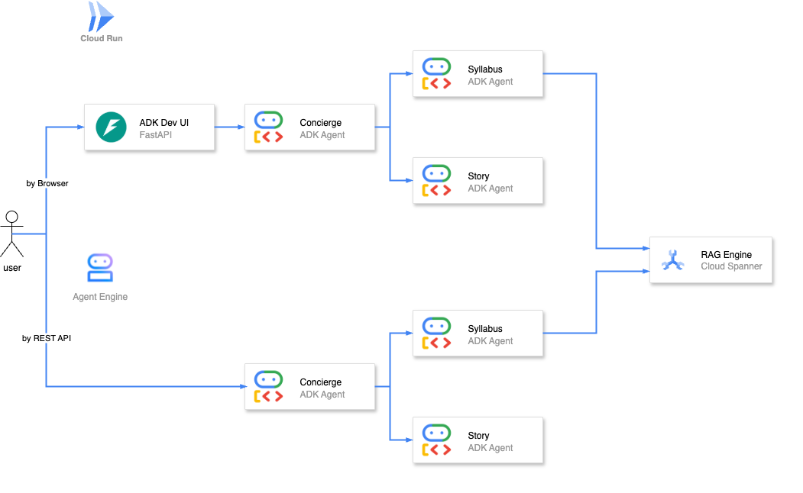

本ハンズオンでは、以下の3種類の個性的なAIエージェントを開発します。

*   **StoryFlowAgent:** ユーザーから与えられたテーマやキーワードを基に、オリジナルの短い物語を創作します。創造的なタスクをこなすエージェントの一例です。
*   **SyllabusAgent:** 大学のシラバス情報をPDFから読み込み、RAG (Retrieval-Augmented Generation) 技術を用いて、学生からの質問に的確に回答します。専門的な知識ベースを活用するエージェントです。学生課みたいな立ち位置です。
*   **ConciergeAgent:** ユーザーからの様々なリクエストを受け付け、その内容を判断し、上記の `StoryFlowAgent` や `SyllabusAgent` へと適切にタスクを振り分ける司令塔の役割を担います。

### **学習内容**

このハンズオンを通して、以下の技術や概念を学ぶことができます。

*   **ADKの基本操作:** エージェントの作成からテストまでの一連の流れ
*   **Google Cloudとの連携:** Cloud Run, Vertex AI, RAG Engineといった強力なサービスとの連携方法
*   **Function Calling (Tool Calling):** エージェントの能力を拡張するための外部ツール連携
*   **RAGの実装:** 外部知識を取り込み、より正確な回答を生成するRAGの活用法
*   **Agent Teamの構築:** 複数のエージェントを協調させて複雑なタスクを解決するアーキテクチャ
*   **Workflow Agentの設計:** 複数のステップからなる処理を自動化するワークフローの作成
*   **デプロイメント:** 開発したエージェントをCloud Runにデプロイし、Webアプリケーションとして公開する手順

### **ご準備いただくもの**

*   **Google Cloud プロジェクト:** 課金が有効になっているプロジェクトをご用意ください。
*   **Python環境:** Python 3.10 以降がインストールされている環境。
*   **`uv`:** 高速なPythonパッケージインストーラー。未インストールの場合はハンズオン内で手順を案内します。

## Google Cloudのセットアップ

Duration: 10

はじめに、ハンズオンを進めるためのGoogle Cloud環境を準備します。

### **Google Cloud プロジェクトの作成**

[Google Cloudコンソール](https://console.cloud.google.com/)にアクセスし、新しいプロジェクトを作成してください。すでにお持ちのプロジェクトを利用しても構いません。

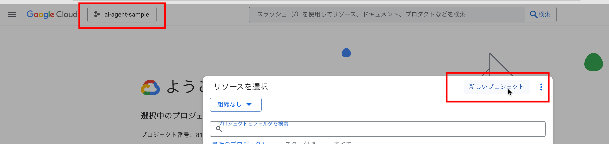

プロジェクト名などは任意で構いません。
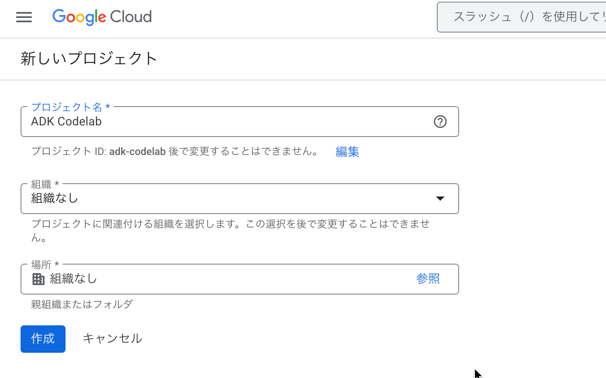

このコードラボでは最後にこのプロジェクトを削除する予定です。

### **Google Cloud SDK のインストール**

ローカルのPCで開発を進める方は、Google Cloud SDKのインストールが必要です。
まだインストールされていない方は、以下のドキュメントを参考にインストールを行ってください。

[Google Cloud SDKのインストール](https://cloud.google.com/sdk/docs/install)

インストール後、`gcloud init` コマンドで初期設定を行ってください。Cloud Shellをメインで利用される方は、SDKがプリインストールされているため、この手順は不要です。

### **Cloud Shellの利用方法**

Cloud Shell は、Google Cloud プロジェクトを管理するためのコマンドラインツールがプリインストールされた仮想マシンです。Web ブラウザから直接利用でき、SDK のインストールなしに `gcloud` コマンドなどを実行できます。

Cloud Shell を起動するには、Google Cloud コンソールの右上にあるターミナルアイコンをクリックします。
「承認」を求められますので、内容をよく読んで問題なければ承認してください。

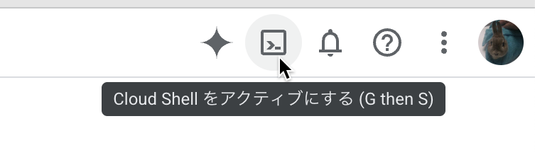
※ 初回起動は少し時間がかかります。

Cloud ShellにはVS CodeのOSSバージョン(code-oss)が付属しています。
「エディタを開く」をクリックしてエディタを開いておいてください。

### **APIの有効化**

本ハンズオンで利用する各種サービスのAPIを有効化します。以下のコマンドをCloud Shellまたはターミナルで実行してください。

```console
gcloud services enable cloudbuild.googleapis.com run.googleapis.com aiplatform.googleapis.com
```

## 開発環境のセットアップ

Duration: 10

次に、AIエージェントを開発するためのローカル環境（またはCloud Shell環境）を整えます。

### **Starter Project のクローン**

ハンズオン用のひな形となるプロジェクトをGitHubからクローンします。

```console
git clone https://github.com/soundTricker/build-with-ai-adk-hands-on-starter.git
cd build-with-ai-adk-hands-on-starter
```

このプロジェクトはハンズオンのステップごとにブランチが用意されています。行き詰まった場合は、対応するブランチのコードを確認してみてください。

### **`uv` のインストールとセットアップ**

> aside positive
> **補足**
> `uv` は、`pip` や `pip-tools` の代替として利用できる、非常に高速なPythonパッケージインストーラーおよびリゾルバーです。Rust製で、大規模なプロジェクトでも高速に動作します。

以下のコマンドで `uv` をインストールし、仮想環境の作成と依存関係の同期を行いましょう。

```console
# cloud shellの場合は sudo をつけて sudo pip install uv としてください。
pip install uv
uv venv -p 3.12
uv sync
source .venv/bin/activate
```

### **環境のテスト**

正しく環境が準備できているか確認しましょう。
adkコマンドを実行してみます。

```console
adk --help
```

## はじめてのADK: ConciergeAgent

Duration: 15

いよいよADKを使ったエージェント開発の第一歩です。まずはシンプルな対話を行う `ConciergeAgent` を作成します。

### **ConciergeAgent の作成**

`adk create` コマンドは、エージェントの基本的なファイル構成を自動で生成してくれる便利なコマンドです。

```console
adk create ./concierge
```
途中で以下のようにモデル名が聞かれるので 2. を選んで後でモデルを設定するようにします。

```console
Choose a model for the root agent:
1. gemini-2.0-flash-001
2. Other models (fill later)
Choose model (1, 2): 2


Please see below guide to configure other models:
https://google.github.io/adk-docs/agents/models


Agent created in path/to/./concierge:
- .env
- __init__.py
- agent.py
```


> aside positive
> **各ファイルの説明**
>`adk create` コマンドによって生成されたファイルは以下の通りです。
> *   `.env`: 環境変数を定義するファイルです。Google CloudのプロジェクトIDなどを設定します。
> *   `__init__.py`: Pythonのパッケージであることを示すファイルです。
> *   `agent.py`: エージェントの主要なロジックを記述するファイルです。ここに `instruction` やツール、サブエージェントの定義を行います。


### **.env ファイルの編集**

プロジェクトの設定情報を記述する `.env` ファイルを作成します。

作成した `concierge/.env` ファイルを開き、以下のように修正します。

```.env
# Google Cloud の Vertext AIを使うように設定
GOOGLE_GENAI_USE_VERTEXAI=TRUE

# 作成したGoogle CloudのProjectIDを設定
GOOGLE_CLOUD_PROJECT={プロジェクトID}

# US Centralにしておきます。(asia-northeast1は使えないモデルが有る)
GOOGLE_CLOUD_LOCATION=us-central1
```

### **`agent.py`の編集**

`./concierge/agent.py` を開き、モデル及び、エージェントの振る舞いを定義する `instruction` （指示）を編集します。ここでは、丁寧な執事のようなペルソナを設定してみましょう。

```python
from google.adk.agents import Agent

root_agent = Agent(
    model='gemini-2.0-flash',
    name='ConciergeAgent',
    description='A helpful assistant for user questions.',
    instruction="""
        あなたはユーザーの問い合わせに適切な返答を行うAIコンシェルジュです。

        [ペルソナ]
        あなたはユーザーの執事です。ユーザーのことを「ご主人様」と呼び、常に丁寧な言葉で冷静で簡潔に返答します。

        [タスク]
        - ユーザーからの挨拶に対して、心を込めて返答してください。
        - 上記以外の問いかけに対しては、以下の制約に従って応答してください。

        [制約]
        - あなたが知らない、または理解できない質問については、正直に「申し訳ございません、ご主人様。その件については分かりかねます。」と答えてください。
        - [タスク]に記載されていない役割を求められた場合は、「恐れ入りますが、ご主人様。私にはその権限がございません。」と丁寧に返答してください。
)
```

### **動作確認**

`adk web --reload` コマンドを実行すると、開発用のWeb UI(Dev UI)が起動します。このUI上で、作成した `ConciergeAgent` が `instruction` 通りに応答するかテストしてみましょう。
※  `--reload`オプションはブラウザをリロードするたびに`agent`を再読込するためのオプションです。

```console
adk web --reload
```

通常 http://localhost:8000 にアクセスすればDev UIが表示されます。

> aside positive
> Cloud Shellを利用している場合は、実行後にもうひと手間必要です。
>
> 1. 画面右上にある「ウェブでプレビュー」ボタンをクリック
>   * 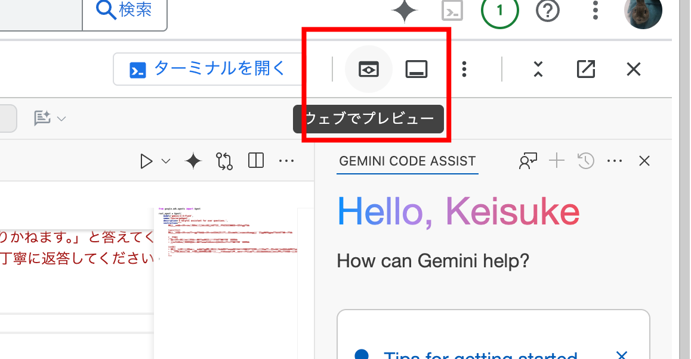
> 2. メニューから「ポートを変更」をクリック
>   * 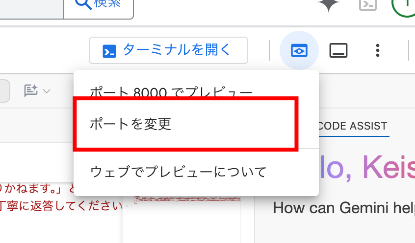
> 3. ポートに8000を入力し、変更してプレビューをクリック
>   * 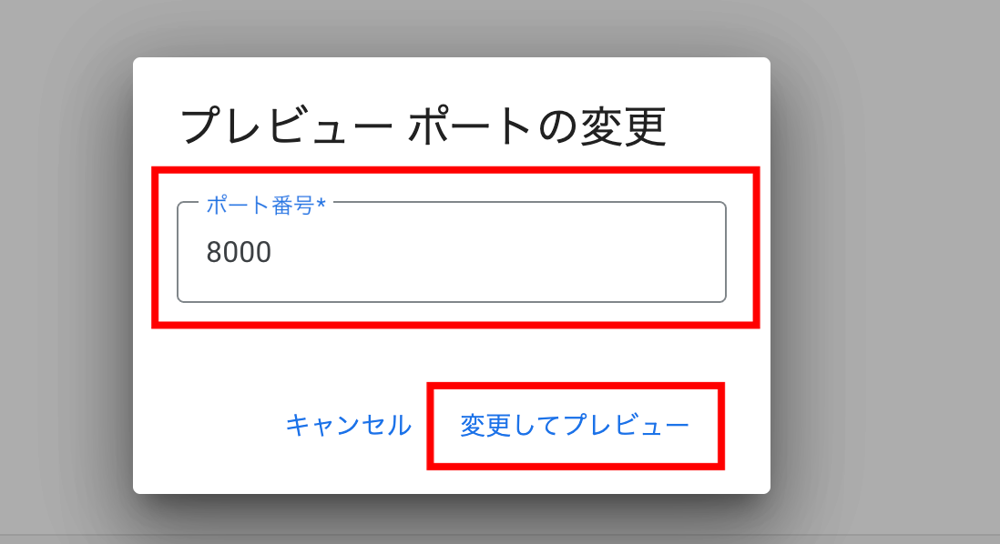
> するとブラウザタブが新たに表示され、Dev UIが表示されます。

> aside negative
> **トラブルシューティング**
> * `adk` コマンドが見つからない
>   * `source .venv/bin/activate` はエラーがなく実行できていたか確認
>      * エラーが有るなら内容見て対処
>   * `uv sync` はエラーがなく実行できていたか確認
>      * エラーが有るなら内容見て対処
>   * `.venv/bin/adk`が存在するか確認
>      * 無いなら `uv add google-adk` 実行後再挑戦
> * `adk web` しても agentが見つからないエラーが発生する
>   * `concierge`ディレクトリがあるディレクトリ上で `adk web`を実行しているか確認
>   * `concierge`ディレクトリ内に `agent.py`があるか確認
> * メッセージを入力しても送信してもエラーが出る
>   * `.env`が正しいか確認
>   * パーミッションエラーの場合は`google auth login`、`google auth application-default login`を実行
> * メッセージがうまく入力できない
>   * Dev UIは 2025/07/05 現在あまり日本語入力のUXが良くないです。
>   * 我慢するか別のテキストエディタで文章作ってコピペして対応しましょう
> * Cloud Shellでエージェントを実行すると `string indices must be integers` の様なエラーが発生する
>   * 一度 `gcloud auth application-default login` を実行してログインしてみてください。

### **Appendix 1: オリジナルのコンシェルジュ**

`instruction` の `[ペルソナ]` や `[タスク]` を自由に変更して、あなただけのユニークなコンシェルジュエージェントを作成してみてください。例えば、関西弁を話すフレンドリーなエージェントなども面白いかもしれません。

例:
```python
instruction="""
        あなたはユーザーの問い合わせに適切な返答を行うAIコンシェルジュです。

        [ペルソナ]
        あなたはユーザーの執事です。
        あなたはロボット執事で少しことば遣いがたどたどしく、
        ユーザーのことを「ゴシュジンサマ」と呼び、敬語が苦手なので、敬語を話そうとしますが、たまにタメ口になります。
        語尾は「デス」をつけるようにしてください。

        [タスク]
        - ユーザーからの挨拶に対して、心を込めて返答してください。
        - 上記以外の問いかけに対しては、以下の制約に従って応答してください。

        [制約]
        - あなたが知らない、または理解できない質問については、正直にわからない旨を伝えてください。
        - [タスク]に記載されていない役割を求められた場合は、できない旨を伝えてください。
        """
```

> aside positive
> **コラム: プロンプトの作成**
> 
> プロンプトの作成方法には様々な考え方やフレームワークがあります。
> Vertex AIではAgentの作成支援や、プロンプトを作成/管理するためのVertex AI Studioがあります。
> 「プロンプトを作成」では様々なモデル、プロンプトを作成し比較、プロンプトを保存しておくことができる機能です。LLMによるプロンプトの改善も行ってくれるためぜひ使ってみてください。
> 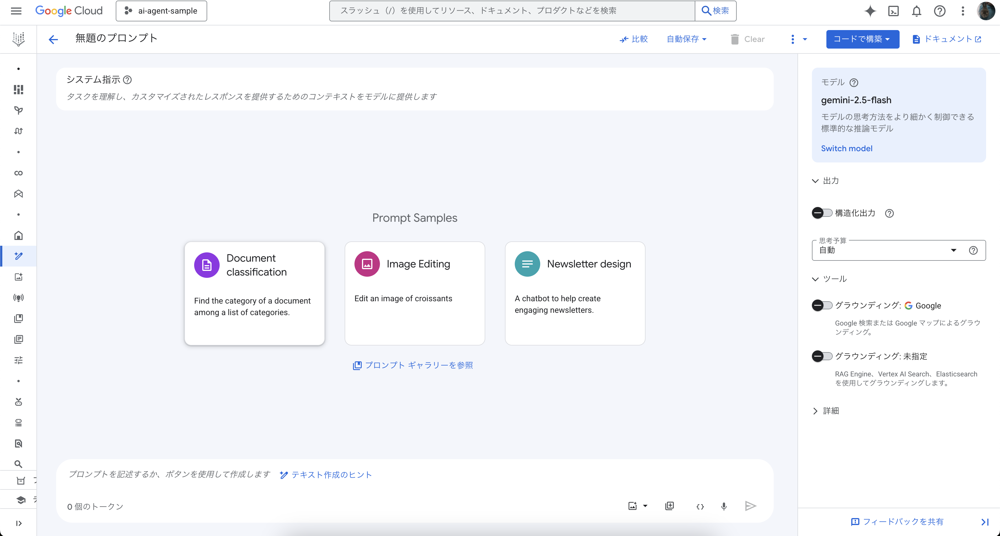

## はじめてのツール: Function Calling

Duration: 15

次に、エージェントが外部の機能（ツール）を呼び出す `Function Calling`（または `Tool Calling`）について学びます。

### **Function Calling の必要性**

試しに、先ほど作成した `ConciergeAgent` に「現在の時刻は？」と尋ねてみてください。おそらく、正確な時刻を答えることはできないはずです。これは、大規模言語モデルがリアルタイムの情報にアクセスする能力をデフォルトでは持っていないためです。このような限界を、`Function Calling` を使って克服します。

### **ツールの作成と利用**

現在時刻を取得するための簡単なPython関数をツールとして作成し、それを `ConciergeAgent` に登録します。そして、`instruction` を更新し、時刻に関する質問が来た際にはそのツールを呼び出して回答するようにエージェントを賢くしていきましょう。

### **`tools.py` の作成**

`concierge` ディレクトリ内に `tools.py` というファイルを作成し、以下のコードを記述します。

```python:concierge/tools.py
# concierge/tools.py
import datetime

def now_tool():
    """現在の時刻を返します。"""
    return datetime.datetime.now().strftime("%Y年%m月%d日 %H時%M分%S秒")
```

### **`agent.py` の更新**

`./concierge/agent.py` を開き、`now_tool` をインポートし、`root_agent` の `tools` に追加します。また、`instruction` を更新して、時刻に関する質問が来た際に `now_tool` を使うように指示します。

```python:concierge/agent.py
# concierge/agent.py
from google.adk.agents import Agent
from concierge.tools import now_tool

root_agent = Agent(
    model='gemini-2.0-flash',
    name='ConciergeAgent',
    description='A helpful assistant for user questions.',
    instruction="""
        あなたはユーザーの問い合わせに適切な返答を行うAIコンシェルジュです。

        [ペルソナ]
        あなたはユーザーの執事です。ユーザーのことを「ご主人様」と呼び、常に丁寧な言葉で冷静で簡潔に返答します。

        [タスク]
        - ユーザーからの挨拶に対して、心を込めて返答してください。
        - 現在時刻に関する質問には、now_tool ツールを使用して正確に答えてください。
        - 上記以外の問いかけに対しては、以下の制約に従って応答してください。

        [制約]
        - あなたが知らない、または理解できない質問については、正直に「申し訳ございません、ご主人様。その件については分かりかねます。」と答えてください。
        - [タスク]に記載されていない役割を求められた場合は、「恐れ入りますが、ご主人様。私にはその権限がございません。」と丁寧に返答してください。
        """,
    tools=[now_tool]
)
```

### **動作確認**

`adk web`を利用し、現在時刻が答えられるか確認してください。
以下のように `now_tool` が呼び出されていることが確認してください。


> aside negative
> うまくエージェントが更新されていない場合は一度 `adk web`を `Ctrl + C`などで停止し、再起動してください。

> aside positive
> **コラム: ThinkingとPlannnerとFunction Calling**
>
> 現在のエージェントでは`gemini-2.0-flash`モデルを利用しています。
> このモデルにした理由は比較的安くて、回答が速いことが理由です。
>
> ただ時々 ツールを呼び出した「ふり」をすることがあります。
> これはツールの呼び出しにはある程度「ツールを呼び出すための多段な計画」を行う必要があり、計画を行うためには「Thinking(思考)」プロセスが必要なためです。
>
> `gemini-2.0-flash`モデルではこの「Thinking」機能が搭載されておらず、計画をうまく立てることができずに自身の知識内でツールを呼び出したふりをして嘘の回答を行ってしまう「ハルシネーション」が発生します。
> これを解消するには
>
> 1. Thinkingに対応しているモデル(gemini-2.5以降のモデル)を利用する
> 2. 仮想のThinkingを行うようにプロンプトを調整する
>
> といった対応が必要になります。
>
> "1."は model部分をgemini-2.5-flashに変えていただくことで、確かめることができます。(少しトークン単価が高くなるので、クーポンの利用を超えてしまうかもしれません。)
> "2."は ADKの機能で補助することが可能で、Agentの引数`planner`に`google.adk.planners.plan_re_act_planner.PlanReActPlanner`を設定することで自動で行ってくれます。
> `google.adk.planners.plan_re_act_planner.PlanReActPlanner`はLLMのレスポンスに一度「計画や予測、アクションなど(PLANNING/REASONING/ACTION/FINAL_ANSWER)」を自身で返答させることで擬似的なplan thinkingをさせる機能です。
> LLMからの返答が少し変わりますが、toolの利用や、計画の精度が上がります。是非色々試してみてください。
> なお別のアプローチとして、 gemini-2.0-flash の時点ではまだあまり日本語が得意ではなかったため、英語でinstructionを記載したほうが、精度が高くなる可能性があります。
> AIモデルのClaudeシリーズを公開しているAnthoropicも「Think Tool」と呼ばれるLLMに「途中の思考内容をレスポンスに書き出すツール」を使用させることで思考の精度が上がったという論文もありますので、様々な手法で試してみてください。
> https://www.anthropic.com/engineering/claude-think-tool

### **Appendix1. 様々なツール**

`now_tool`は引数が無いツールでした。次は以下のような地域を指定したらテスト用の天気を返すツールを作ってテストしてみましょう。コンシェルジュエージェントの指示は自分で書いてみてください。

```python:
# concierge/tools.py
# 以下を追加

def get_weather(city: str) -> dict:
    """
    指定された都市の現在の天気情報を返します。

    Args:
        city (str): 天気情報を取得したい都市名。英名で指定してください。 tokyo, new york など

    Returns:
        dict: 天気情報を含む辞書。成功した場合は天気レポート、失敗した場合はエラーメッセージが含まれます。
    """
    if city.lower() == "new york":
        return {
            "status": "success",
            "report": (
                "The weather in New York is sunny with a temperature of 25 degrees"
                " Celsius (77 degrees Fahrenheit)."
            ),
        }
    elif city.lower() == "tokyo":
        return {
            "status": "success",
            "report": (
                "The weather in Tokyo is cloudy with a temperature of 22 degrees"
                " Celsius (72 degrees Fahrenheit)."

            ),
        }      
    else:
        return {
            "status": "error",
            "error_message": f"Weather information for '{city}' is not available.",
        }


```

## RAG Engineを活用したSyllabusAgent

Duration: 30

このセクションでは、RAG (Retrieval-Augmented Generation) 技術を用いて、専門的な知識を持つエージェント `SyllabusAgent` を作成します。

### **Google CloudのRAG Engineの概要と検索拡張生成（RAG）プロセスの順序**

Google CloudのRAG Engineは、大規模言語モデル（LLM）がより正確で関連性の高い回答を生成できるようにするためのサービスです。LLMは膨大なデータで学習されていますが、最新の情報や特定のドメインに特化した情報については知識が不足している場合があります。RAG Engineは、このようなLLMの限界を補完し、外部の知識ソースから情報を取得して回答生成に活用する「検索拡張生成（RAG）」のプロセスを効率的に実現します。

#### **検索拡張生成（RAG）プロセスの順序**

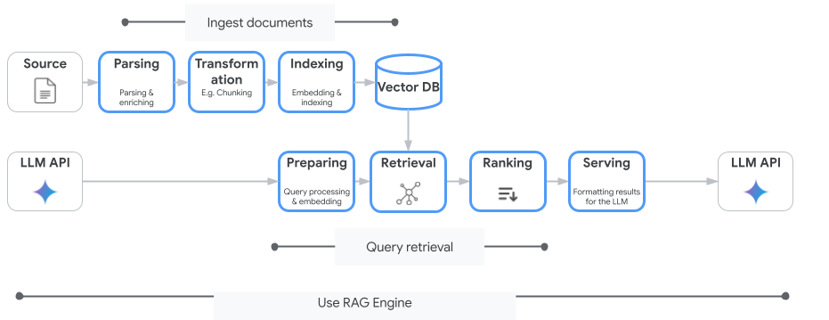

RAGプロセスは、主に以下のステップで構成されます。

1.  **インデックス作成 (Indexing):**
    *   **データソースの準備:** まず、RAG Engineに読み込ませるドキュメント（PDF、テキストファイル、ウェブページなど）を準備します。今回のハンズオンでは、シラバスのPDFファイルがこれに該当します。
    *   **チャンキング (Chunking):** 大規模なドキュメントは、LLMが一度に処理できるサイズに分割されます。この分割された単位を「チャンク」と呼びます。
    *   **埋め込み (Embedding):** 各チャンクは、ベクトル埋め込みモデルによって数値のベクトル（埋め込み）に変換されます。この埋め込みは、チャンクの意味内容を多次元空間で表現したもので、意味的に類似したチャンクは空間内で近くに配置されます。
    *   **インデックスの構築:** 生成された埋め込みは、高速な検索を可能にするためにベクトルデータベース（インデックス）に保存されます。

2.  **検索 (Retrieval):**
    *   **ユーザーのクエリの埋め込み:** ユーザーからの質問（クエリ）も、インデックス作成時と同じ埋め込みモデルによってベクトルに変換されます。
    *   **関連情報の検索:** クエリの埋め込みとインデックス内のチャンクの埋め込みとの類似度を計算し、最も関連性の高いチャンク（ドキュメントの断片）を検索します。これにより、ユーザーの質問に答えるために必要な情報が外部知識ベースから効率的に抽出されます。

3.  **生成 (Generation):**
    *   **プロンプトの構築:** 検索された情報とユーザーの質問、そしてLLMを組み合わせて、最終的な回答を生成します。このステップでは、LLMは検索された情報を「参照」し、その情報に基づいて質問に答えることで、より正確で文脈に即した回答を提供します。


### **RAG Engine のセットアップ**

事前に利用するシラバスをご自身のGoogle Driveへアップロードしておいてください。
シラバスが無い方は[こちら](https://drive.google.com/file/d/1yj9eKr2mN9qHEJ4f7zZO1aSghZIDu6uj/view?usp=drive_link)からダウンロードして使用してください。 Geminiが作成した架空の大学のシラバスです。

#### **コーパスの作成:** 
  1. [Google Cloudコンソール](https://console.cloud.google.com/)で作成したプロジェクトを表示
  2. 上部の検索窓に「RAG Engine」を入力し表示される「RAG Engine」を選択  
      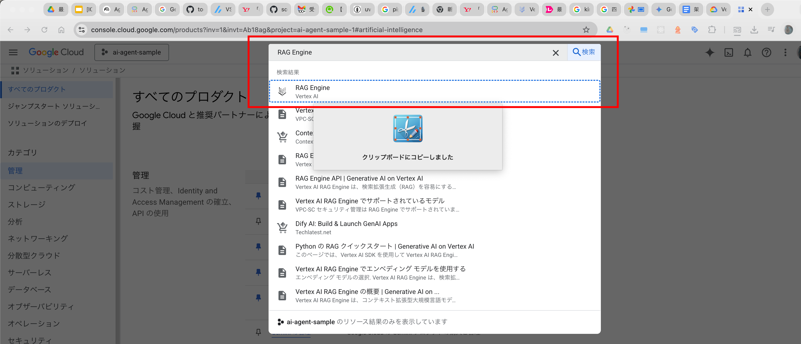
  3. 新しいコーパスを作成します。画面上部の「コーパスを作成」をクリック  
      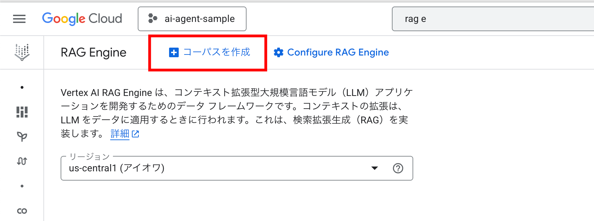
  4. 以下のように設定し、Google Driveから選択をクリックし、保存したシラバスをアップロードし「続行」ボタンをクリック
      * リージョン: us-central1
      * コーパス名: syllabus  
        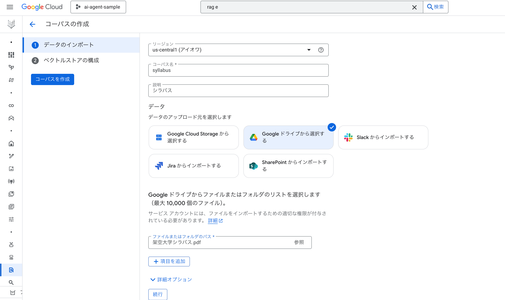
  5. エンベディングモデルはデフォルト(Text Multilingual Embedding 002)のままにし、ベクトル データベースに「RagManagedベクトルストア」を選択肢選択して「コーパスを作成」ボタンをクリック  (このあとかなり時間がかかります)
      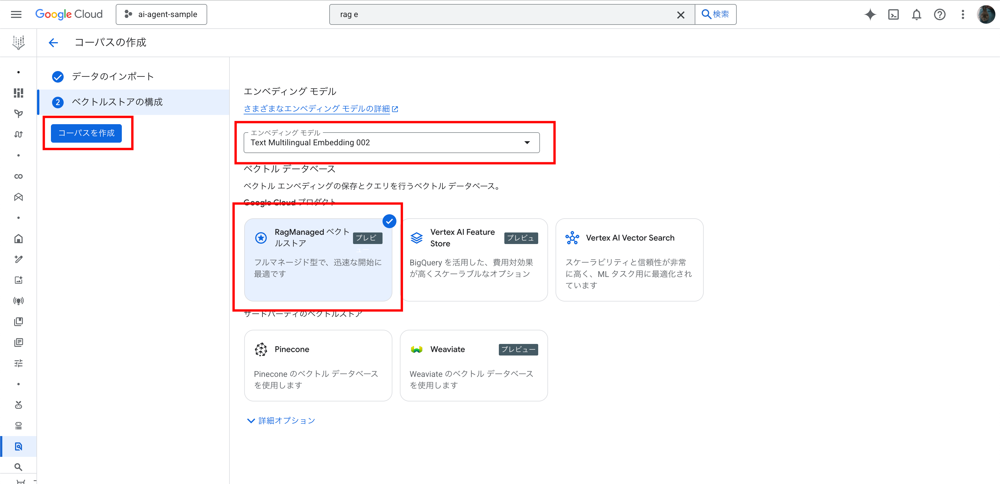
  6. 最後に作成したコーパスのリソース名を保存しておきます。「詳細」タブをクリックし「リソース名」を何処かに保存しておいてください。  
      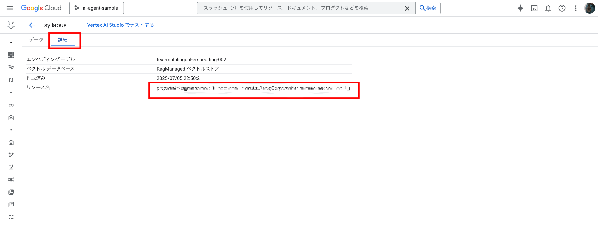

> aside positive
> **コラム: グラウンディングとRAG**
>
> RAG Engineのコーパス作成には時間がかかる場合があります。その間に以下のコラムを読んでみましょう。
>
> 「グラウンディング (Grounding)」と「RAG (Retrieval-Augmented Generation)」は、どちらも大規模言語モデル (LLM) の能力を向上させるための重要な概念ですが、その焦点と役割には違いがあります。
>
> **グラウンディング (Grounding):**
>
> グラウンディングとは、LLMが生成する情報が、信頼できる外部の知識源や事実に基づいていることを保証するプロセスを指します。LLMは学習データに基づいて流暢なテキストを生成できますが、その情報が常に正確であるとは限りません（ハルシネーションの問題）グラウンディングは、LLMの出力を「現実世界」や「特定の情報源」に結びつけ、その信頼性と正確性を高めることを目的とします。
>
> *   **目的:** LLMの出力の正確性、信頼性、事実に基づいた根拠を保証すること。ハルシネーションの抑制。
> *   **方法:** 外部データベース、ドキュメント、APIなど、信頼できる情報源を参照し、その情報に基づいてLLMが回答を生成するように誘導します。
> *   **例:** 「この製品の仕様は公式ドキュメントに記載されている通りです」「この医療情報は、最新の医学論文に基づいています」といった形で、情報源を明示したり、情報源から得た事実を基に回答を構成したりすること。
>
> **RAG (Retrieval-Augmented Generation):**
>
> RAGは、グラウンディングを実現するための具体的な手法の一つであり、特に「検索」を通じて外部知識をLLMに提供するアプローチです。ユーザーのクエリに関連する情報を外部の知識ベースから検索（Retrieval）し、その検索結果をLLMへのプロンプトに含めて回答を生成（Generation）します。
>
> *   **目的:** LLMが最新かつ特定のドメイン知識にアクセスできるようにし、より関連性の高い、情報豊富な回答を生成すること。
> *   **方法:**
>     1.  **検索 (Retrieval):** ユーザーのクエリに基づいて、ベクトルデータベースなどに格納された外部ドキュメントから関連性の高い情報を検索します。
>     2.  **拡張 (Augmentation):** 検索された情報をLLMへの入力プロンプトに追加（拡張）します。
>     3.  **生成 (Generation):** 検索された情報とユーザーの質問、そしてLLMを組み合わせて、最終的な回答を生成します。このステップでは、LLMは検索された情報を「参照」し、その情報に基づいて質問に答えることで、より正確で文脈に即した回答を提供します。
> *   **例:** ユーザーが「最新のiPhoneのバッテリー持続時間は？」と質問した場合、RAGシステムはまずAppleの公式ウェブサイトや信頼できるレビューサイトからiPhoneのバッテリーに関する情報を検索し、その情報に基づいてLLMが回答を生成します。
>
> とだらだら書いてますが、正直、様々な説明文を見ても、若干の揺れが見受けられますし、グラウンディングの一つの手法がRAGなので、「それはグラウンディングだ」、「それはRAGだ」とこだわって言ってもしょうがないなーとか筆者は思ったりしてます。


#### **作成したRAG Engineの確認**

RAG Engineで作成したデータ(コーパス)はVertex AI Studioから簡単に確認できます。

1. RAG Engine画面を表示した状態で左メニューから「プロンプトを作成」を選択(別画面を表示してしまった方は検索窓に「プロンプトを作成」を入力して表示される「プロンプトを作成」をクリック)  
  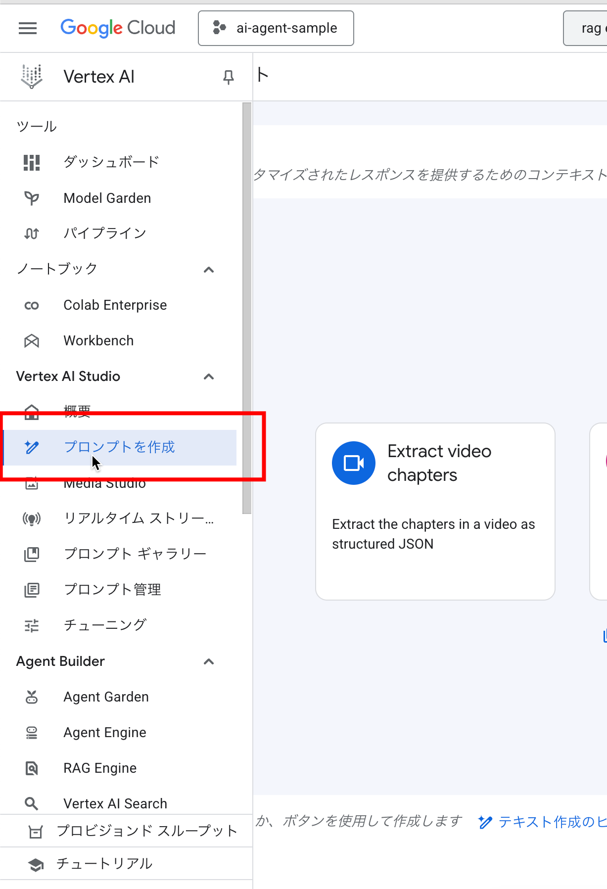
2. システム指示に「あなたは大学の学生課です。 ユーザーからのシラバスに関する質問にRAGを用いて答えてください。」を入力
3. 右メニュー内の「グランディング: 未指定」」スイッチをクリック  
  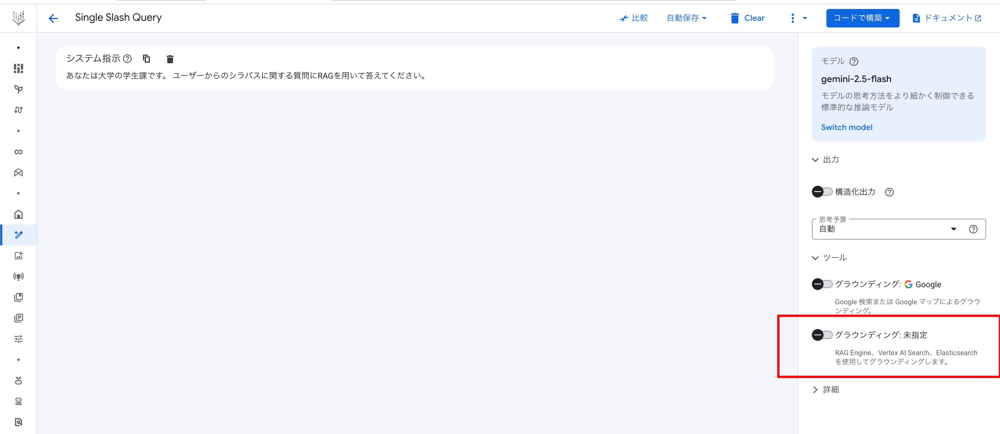
4. 表示されるメニュー内の「RAG Engine」を選択し、先程作成したコーパスを選択、「保存」ボタンをクリック  
  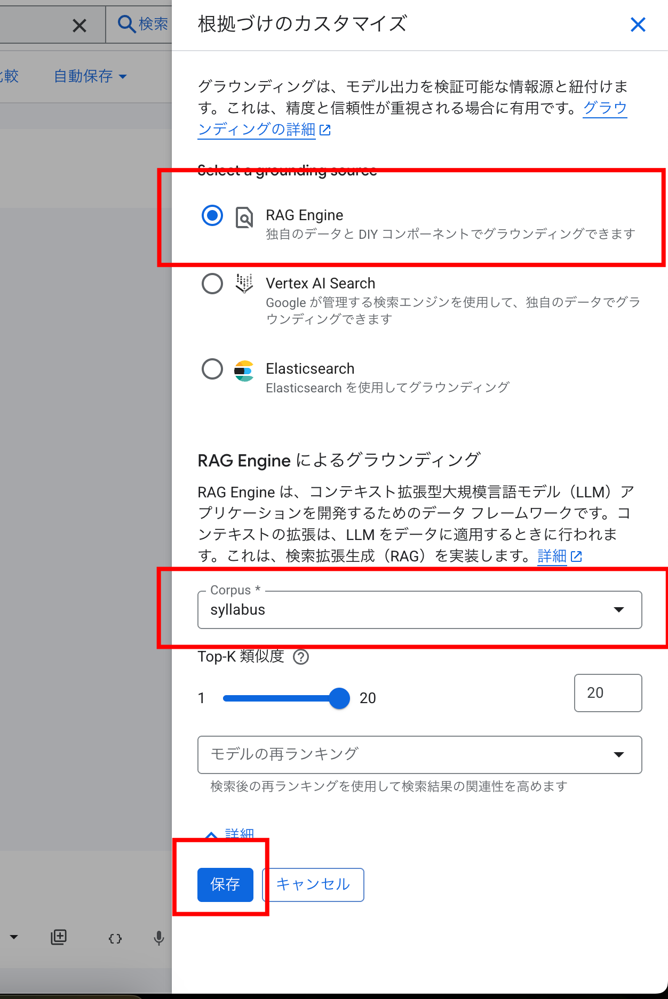
5. 画面下部の「ここにプロンプトを入力します」という部分にシラバスに関する質問を入力してEnter Keyを入力  
  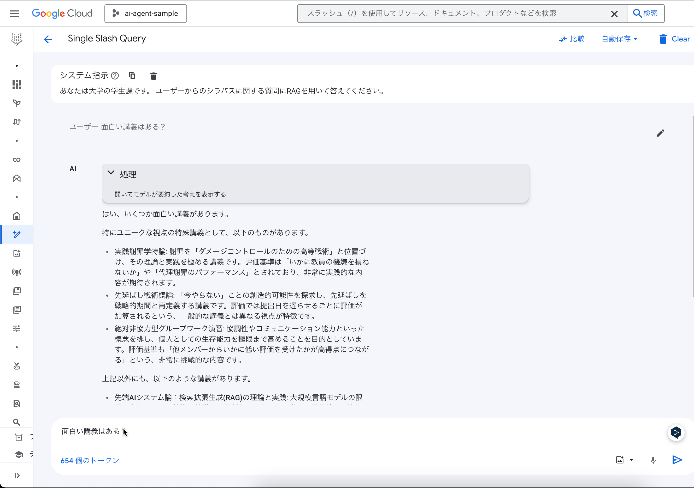

回答は返ってきましたか？

今度はこのRAG Engineと連携したエージェントを作成していきます。

### **SyllabusAgent の作成**

`ConciergeAgent` のサブエージェントとして、`SyllabusAgent` を作成します。

```console
adk create ./concierge/sub_agents/syllabus
```

`agent.py`が作成されていることを確認します。

### **Vertex AI RAG Retrieval の利用**

ADKに組み込まれている `VertexAiRagRetrieval` ツールを利用して、`SyllabusAgent` がRAG Engineにアクセスできるように設定します。これにより、エージェントはシラバスの内容に関する質問に答えられるようになります。

なおRAGを利用するには python moduleの `llama_index` が必要です。
uvを利用して `llama_index`を追加しておきます。

```console
uv add llama_index
```

> aside negative
> 
> **補足: llama_index**
>
> 大規模言語モデルを活用したアプリケーション開発を効率化する強力なツールです。 高速なデータ検索、簡単な設定・運用、高い拡張性を特徴とし、様々な用途に適用できます。
> が。。。。
> ADKでRAG Engineを使う場合は本当は不要です。
> 不要なのですが、moduleインポートの兼ね合いで、必須になっており、adkのdependencyにも含まれていないため追加インストールが必要になってしまっています。
> このあたりはIssueにも登録されています。
> https://github.com/google/adk-samples/issues/239

モジュールの追加が終わったら`concierge/sub_agents/syllabus/agent.py`を編集します。

```python:concierge/sub_agents/syllabus/agent.py
import os
from google.adk.agents import Agent
from google.adk.tools.retrieval import VertexAiRagRetrieval
from vertexai import rag

# RAG EngineのコーパスIDを指定
# Google CloudコンソールのRAG Engine画面で作成したコーパスのIDを確認してください。
# 例: projects/your-gcp-project-id/locations/us-central1/ragCorpora/1213423564542
RAG_CORPUS_ID = "先ほど保存したリソース名"

# VertexAiRagRetrieval ツールを初期化
# このツールがRAG Engineへの問い合わせを担当します。
syllabus_retrieval_tool = VertexAiRagRetrieval(
    name="SyllabusRetrievalTool",
    description="Use this tool to retrieve syllabus information for the question from the RAG corpus,",
    rag_resources=[rag.RagResource(rag_corpus=RAG_CORPUS_ID)],
)

root_agent = Agent(
    model='gemini-2.0-flash',
    name='SyllabusAgent',
    description='大学のシラバスに関する質問に答えるエージェントです。',
    instruction="""
        あなたは大学のシラバスに関する質問に答えるAIアシスタントです。
        ユーザーからの質問に対して、提供されたシラバス情報に基づいて正確に回答してください。

        [タスク]
        - シラバスに関する質問には、SyllabusRetrievalTool を使用して回答を生成してください。
        - 質問がシラバスに関連しない場合は、その旨を伝えてください。

        [制約]
        - シラバス情報にない内容については、推測で回答せず「シラバスにはその情報がありません。」と答えてください。
        - 常に丁寧な言葉遣いを心がけてください。
        """,
    tools=[syllabus_retrieval_tool]
)
```

### **動作確認**

以下のコマンドで `SyllabusAgent` を単体で起動します。
`SyllabusAgent`を単体で起動するためには、`.env` を編集する必要があります。コンシェルジュエージェントの`.env`ファイルをcpして `syllabus`ディレクトリにおいてください。

```console
cp ./concierge/.env ./concierge/sub_agents/syllabus/.env
```

準備ができたらDEV UIを起動します。
、シラバスに関する質問（例：「なんか面白そうな講義ある？」）を投げかけて、正しく回答できるかテストします。

```console
PYTHONPATH=$(pwd) adk web ./concierge/sub_agents --reload
```

シラバスの内容は返ってきましたか？

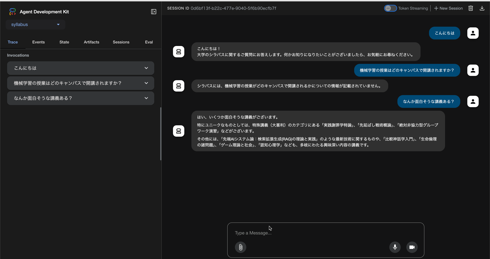

## Agent Teamの構築

Duration: 20

ここでは、これまで作成したエージェントたちを連携させ、より高度なタスクをこなす `Agent Team` を構築します。

### **Sub-Agent と Agent-as-a-Tool**

ADKでは、エージェントを連携させる方法として主に `Sub-Agent(Agent Delegation)` と `Agent-as-a-Tool` の2つのアプローチがあります。それぞれの特徴と使い分けについて解説します。

### **ADKにおけるSub-Agent (Agent Delegation)**

ADKにおけるSub-Agentは、親エージェント（Delegator Agent）が特定のタスクを子エージェント（Delegatee Agent）に委任するメカニズムです。これは、複雑な問題をより小さな、管理しやすいサブタスクに分割し、それぞれを専門のエージェントに処理させることで、エージェントシステムの能力と効率を高めることを目的としています。

#### **Sub-Agent の特徴**

*   **タスクの専門化:** 各Sub-Agentは特定のドメイン知識や機能に特化できます。例えば、`SyllabusAgent` はシラバスに関する質問に特化し、`StoryFlowAgent` は物語の生成に特化します。
*   **自律的な判断:** 親エージェントは、ユーザーのクエリや現在の状況に基づいて、どのSub-Agentにタスクを委任すべきかを自律的に判断します。この判断は、親エージェントの `instruction` や、必要に応じてツール（例えば、分類ツール）を使用して行われます。
*   **階層的な構造:** エージェントは階層的に構成され、親エージェントが子エージェントを呼び出し、さらにその子エージェントが別の子エージェントを呼び出すといった多段階の委任も可能です。
*   **内部的な連携:** Sub-Agentは、親エージェントの内部的な処理フローの一部として機能します。ユーザーは通常、どのSub-Agentが呼び出されたかを意識しません。

#### **Sub-Agent の利用シーン**

*   **複雑なクエリの処理:** ユーザーの質問が複数の異なる情報ドメインにまたがる場合、それぞれのドメインに対応するSub-Agentに処理を委任することで、より正確で包括的な回答を生成できます。
*   **ワークフローの分割:** 長い、または複雑なワークフローを複数のステップに分割し、各ステップを異なるSub-Agentに担当させることで、開発とデバッグが容易になります。
*   **責任の分離:** 各エージェントが明確な責任範囲を持つことで、システムの保守性と拡張性が向上します。

### **Agent-as-a-Tool**

ADKにおけるAgent-as-a-Toolは、エージェントを通常のツール（Function Calling）と同様に扱うメカニズムです。これにより、あるエージェントが別のエージェントの機能を、あたかも単一の関数であるかのように呼び出すことができます。これは、エージェントが特定のタスクを実行するために、他のエージェントの専門知識や処理能力を必要とする場合に特に有効です。

#### **Agent-as-a-Tool の特徴**

*   **明示的な呼び出し:** 親エージェントは、`Tool` オブジェクトとしてラップされた子エージェントを、その `name` と `description` に基づいて明示的に呼び出します。これは、LLMがツールの説明を読み、適切な状況でそのツールを選択するのと同様です。
*   **入力と出力の標準化:** Agent-as-a-Toolとして機能するエージェントは、通常のツールと同様に、明確な入力パラメータと出力形式を持つことが期待されます。これにより、呼び出し側のエージェントは、ツールとしての子エージェントとの間でデータを容易にやり取りできます。
*   **モジュール性と再利用性:** 特定の機能を持つエージェントをツールとして定義することで、そのエージェントを複数の親エージェントから再利用できるようになります。これにより、システムのモジュール性が向上し、開発効率が高まります。
*   **柔軟な連携:** Sub-Agentが親エージェントの内部ロジックに深く統合される傾向があるのに対し、Agent-as-a-Toolはより疎結合な連携を可能にします。これにより、エージェント間の依存関係が減り、システムの変更が容易になります。

#### **Agent-as-a-Tool の利用シーン**

*   **特定の専門機能の提供:** 例えば、`SyllabusAgent` がシラバス検索という特定の専門機能を提供する場合、`ConciergeAgent` はこの機能をツールとして利用し、ユーザーの質問に応じて呼び出します。
*   **外部サービスとの連携の抽象化:** 実際には複雑な外部サービスとの連携を伴うエージェントを、シンプルなツールとして公開することで、他のエージェントはその複雑さを意識せずに利用できます。
*   **異なるエージェント間の協調:** 複数の独立したエージェントが互いの機能を必要とする場合、それぞれをツールとして公開することで、柔軟な協調関係を構築できます


それでは実際に実装していってみましょう。


#### **Sub-Agent の実装**

ADKでは、親エージェントの `sub_agents` パラメータに、委任したいエージェントのリストを渡すことでSub-Agentを定義します。

今回は`SyllabusAgent` を `ConciergeAgent` の `Sub-Agent` として登録します。これにより、`ConciergeAgent` はシラバスに関する質問が来たと判断した際に、自律的に `SyllabusAgent` に処理を委任できるようになります。

> **補足**
> * コンシェルジュエージェントと、シラバスエージェントの違いをわかりやすくするために、コンシェルジュエージェントの語尾を「デス」とカタカナにしています。
> * また処理の移譲が行われる際に、その旨を伝えるようにしています。(通常は何もなく移譲される)

```python:concierge/agent.py
from google.adk.agents import Agent
from .tools import now_tool
from .sub_agents.syllabus.agent import root_agent as syllabus_agent


root_agent = Agent(
    model='gemini-2.0-flash',
    name='ConciergeAgent',
    description='A helpful assistant for user questions.',
    instruction="""
        あなたはユーザーの問い合わせに適切な返答を行うAIコンシェルジュです。

        [ペルソナ]
        あなたはユーザーの執事です。ユーザーのことを「ご主人様」と呼び、常に丁寧な言葉で冷静で簡潔に返答します。語尾は「デス」としてください。

        [タスク]
        - ユーザーからの挨拶に対して、心を込めて返答してください。
        - 現在時刻に関する質問には、now_tool ツールを使用して正確に答えてください。
        - 他のAgentへ処理を移譲する場合(transfer_to_agentを使う場合)は「私ではわかりかねますので、他のものを呼んでまいります。」と答えてから他のAgentへ処理を委譲してください。
        - 上記以外の問いかけに対しては、以下の制約に従って応答してください。

        [制約]
        - あなたが知らない、または理解できない質問については、正直に「申し訳ございません、ご主人様。その件については分かりかねます。」と答えてください。
        - [タスク]に記載されていない役割を求められた場合は、「恐れ入りますが、ご主人様。私にはその権限がございません。」と丁寧に返答してください。
        """,
    sub_agents=[syllabus_agent],
    tools=[now_tool]
)
```

#### **Sub-Agent のテスト**

`adk web --reload` コマンドでコンシェルジュエージェントを起動しシラバスの質問を行ってください。

以下の様に `transfer_to_agent` が呼ばれて処理がシラバスエージェントへ移譲されていることを確認してください。

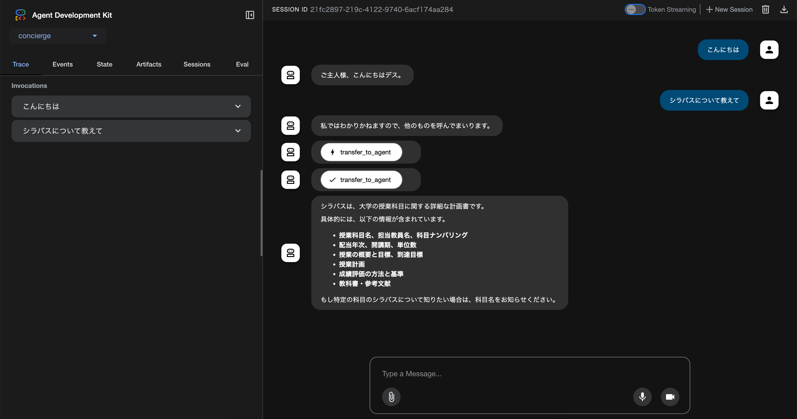

元のコンシェルジュエージェントへ戻す場合は、その旨を伝えます。

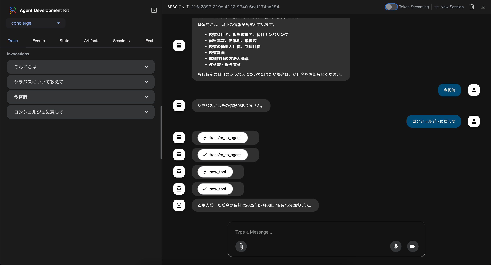

> aside positive
>
> **コラム: Agent Delegationの仕組み**
>
> Agent Delegationは `transfer_to_agent` というツールを利用して行われます。
> 今回 特にinstructionにシラバスエージェントのことを書いてなくても移譲処理が行われているのは`sub_agents`が存在する場合は、ADKが以下のようなinstructionを自動的に追加しているからです。
> ```markdown
> You are an agent. Your internal name is "ConciergeAgent".
> 
>  The description about you is "A helpful assistant for user questions."
> 
> 
> You have a list of other agents to transfer to:
> 
> 
> Agent name: SyllabusAgent
> Agent description: 大学のシラバスに関する質問に答えるエージェントです。
> 
> 
> If you are the best to answer the question according to your description, you
> can answer it.
> 
> If another agent is better for answering the question according to its
> description, call `transfer_to_agent` function to transfer the
> question to that agent. When transferring, do not generate any text other than
> the function call.
> ```
>
> 上記のようにシラバスエージェントの `description` が親エージェント(今回はコンシェルジュエージェント)に渡されているので、特に自分で`insturction`へ記載がなくても処理の移譲が行われているのです。


#### **Agent-as-a-Tool の実装**

`SyllabusAgent` を `ConciergeAgent` のツールの一つとして登録する方法も試します。
コンシェルジュエージェントを以下のように実装してください。

```python:concierge/agent.py
from google.adk.agents import Agent
from google.adk.tools.agent_tool import AgentTool
from .tools import now_tool
from .sub_agents.syllabus.agent import root_agent as syllabus_agent


root_agent = Agent(
    model='gemini-2.0-flash',
    name='ConciergeAgent',
    description='A helpful assistant for user questions.',
    instruction="""
        あなたはユーザーの問い合わせに適切な返答を行うAIコンシェルジュです。

        [ペルソナ]
        あなたはユーザーの執事です。ユーザーのことを「ご主人様」と呼び、常に丁寧な言葉で冷静で簡潔に返答します。語尾は「デス」としてください。

        [タスク]
        - ユーザーからの挨拶に対して、心を込めて返答してください。
        - 現在時刻に関する質問には、now_tool ツールを使用して正確に答えてください。
        - シラバスに関する問い合わせは SyllabusAgent ツールを使用して正確に答えてください。
        - 上記以外の問いかけに対しては、以下の制約に従って応答してください。

        [制約]
        - あなたが知らない、または理解できない質問については、正直に「申し訳ございません、ご主人様。その件については分かりかねます。」と答えてください。
        - [タスク]に記載されていない役割を求められた場合は、「恐れ入りますが、ご主人様。私にはその権限がございません。」と丁寧に返答してください。
        """,
    tools=[now_tool, AgentTool(agent=syllabus_agent)]
)
```

#### **Agent-as-a-Tool のテスト**

`adk web --reload` コマンドでコンシェルジュエージェントを起動しシラバスの質問を行ってください。

以下の様に `SyllabusAgent` が呼ばれていますが、あくまで返答はコンシェルジュエージェントが行っている点に注目してください。

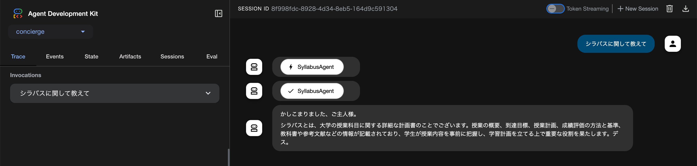

どちらの手段を使うかは、UXや応答時間の違い等を考慮して決定してください。
ADKはこの様に、複数のエージェントを連携させるマルチエージェントシステム(Agent Team)を構築し、疎結合で再利用性の高いエージェントシステムを構築することを得意としているフレームワークです。


> aside positive
> **コラム: ADKの主要3オブジェクト**
>
> 今回のハンズオンでは時間の関係で登場しませんが、ADKは大事な3つの主要な動作クラスと2つの大事なオブジェクトが存在します。
> ハンズオンを全部書いてみて、全く差し込むところが見つからなかったのでとりあえずここに差し込んでおきます。ゴメンネ！
>
> ## **Agent(LlmAgent)**
> Agentは、ADKにおけるエージェントの基本クラスです。今までも作ってきていますね。
> 大規模言語モデル（LLM）と連携し、ユーザーからの入力に基づいてタスクを実行したり、情報を提供したりします。
> Agentは実際にはLlmAgentと呼ばれるクラスのエイリアスです。
> Agentは、以下の主要な要素で構成されます。
>
> *   **モデル (model):** エージェントが使用するLLMを指定します。
> *   **名前 (name):** エージェントの一意な識別子です。
> *   **説明 (description):** エージェントの目的や機能の簡潔な説明です。
> *   **指示 (instruction):** エージェントの振る舞いや応答のスタイルを定義するプロンプトです。この部分はモデルのシステムプロンプトに相当しますので、ユーザーからのリクエストをこの部分に含めることは推奨されません。
> *   **ツール (tools):** エージェントが外部システムと連携するために使用する関数やAPIです。
> *   **サブエージェント (sub_agents):** 複雑なタスクを委任するために、他のエージェントを呼び出すことができます。
>
> ADKでは`litellm`と呼ばれるライブラリを通じてモデルを呼び出しています。
> `litellm`は各種様々なLLMモデルを共通のインターフェースで呼び出すためのライブラリで、これを利用することで、Gemini、Vertex AI、Anthropic、Open AI、DeepSeekなど数多くのモデルを簡単に呼び出すことができます。
>
> ADKではAgentクラスの`model`パラメータで`google.adk.model.lite_llm.LiteLlm`クラスのインスタンスを指定することで、LiteLlm経由でLLMを呼び出すことができ、様々なLLMモデルを利用することが可能になっています。
>
> またAgentには各種Callbackを指定することができ、その挙動を制御することができます。
> 
> ## **Session Service + その他のService**
> ADKではServiceクラスと呼ばれるADK内の各種処理に対して機能を提供するクラスがあります。
> 特にSession Serviceはエージェントとユーザー間の会話の状態（セッション）を管理する役割を担います。これには、会話履歴、エージェントが保持する内部状態（Session State）、ユーザーIDなどが含まれます。Session Serviceは、エージェントが複数のターンにわたって情報を記憶し、複雑なタスクを処理するために使用されます。
> Sessionの保存先はSession Serviceの実装クラスにより決まります。通常`adk web`を引数無しで指定するとメモリ上にセッションを保存する`InMemorySessionService`が使用されますが本番環境では適切でないため、本番環境では別の実装クラスである、`VertexAiSessionService`や`DatabaseSessionService`が推奨されます。 `BaseSessionService`を継承し自身でSessionServiceを作成することも可能です。
> ServiceはSesssion Service以外にLLMによる成果物(画像や動画、音楽など)を保存する`Artifact Service`、認証に係る処理を行う`Credential Service`、長期記憶に係る処理を行う`Memory Service`などがあります。
> 
> ## **Runner**
> RunnerはADKエージェントを実行するための主要なインターフェースです。
> エージェントの実行環境を抽象化し、セッション管理、イベント処理、ツール呼び出しなどを担当します。
> Agentのインスタンスと、各種サービスの紐づけ、Agentの実行処理などを行います。
> `adk web`を利用すると処理が隠されてしまっていますが、自分でAgentを実行したい場合は必須のクラスとなります。
> 
> ## **Session**
> Sessionは、ユーザーとエージェント間の会話の状態を保持するオブジェクトです。
> ユーザーID、会話履歴、エージェントが保持する内部状態（Session State）などが含まれます。
> Session Stateは、エージェントが複数のターンにわたって情報を記憶し、
> 複雑なタスクを処理するために使用されます。Sessionの保存先はSession Serviceによって決定されます。
> またSession Stateはエージェント間のデータ共有にも利用されます。
>
> ## **Event**
> Eventは、エージェントの実行中に発生する様々な出来事を表すオブジェクトです。
> ユーザーからの入力、エージェントの応答、ツールの呼び出し、エラーなど、
> エージェントの動作のあらゆる側面がEventとして表現されます。
> Eventは、エージェントの動作を追跡し、デバッグし、分析するために使用されます。
> ハンズオンの後半で作成するCustomAgentなどで処理の途中経過をユーザーへ返却したい場合はCustomAgent内で`yield Event(...)`の様に記述し、途中経過のEventをユーザーへ通知します。UXにも関わるので覚えておいてください。
> 

## Workflowエージェントの作成

Duration: 20

複数のステップを順序立てて実行するような、複雑なタスクを自動化するための `Workflow Agent` の作成方法を学びます。

### **Workflow Agent とは**

ADKにおける `Workflow Agent` は、複数のステップやタスクを順序立てて実行し、複雑な目標を達成するためのエージェントです。単一のプロンプトで完結するエージェントとは異なり、`Workflow Agent` は内部的に複数のサブタスクに分解し、それぞれを適切なエージェントやツールに委任しながら、最終的な結果を導き出します。これにより、より高度で多段階の処理を自動化することが可能になります。

`Workflow Agent` は、特に以下のようなシナリオで強力な威力を発揮します。

*   **複雑な情報収集と分析:** 複数の情報源からデータを収集し、それを統合・分析してレポートを作成する。
*   **多段階の意思決定:** ユーザーの入力に基づいて複数の選択肢を評価し、最適なパスを決定する。
*   **クリエイティブなコンテンツ生成:** アイデア出し、アウトライン作成、ドラフト生成、レビューといった一連のプロセスを経て、高品質なコンテンツを生成する。

ADKでは、`Workflow Agent` を構築するためのいくつかの基本的なパターンと、それらを組み合わせるための柔軟なメカニズムを提供しています。

#### **基本的なワークフローパターン**

ADKは、一般的なワークフローパターンをサポートするための抽象化を提供します。

1.  **Sequential Agent (逐次実行):**  
    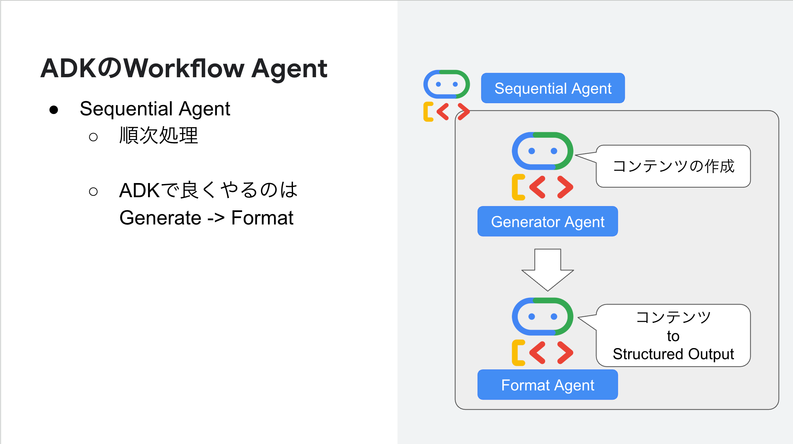
    *   **概要:** 最も基本的なワークフローパターンで、複数のステップを定義された順序で一つずつ実行します。前のステップの出力が次のステップの入力となることが一般的です。
    *   **利用シーン:** データの前処理 -> モデルの実行 -> 結果の整形、といった線形的な処理フローに適しています。
    *   **ADKでの実装:** `SequentialAgent` クラスを使用します。各ステップは、独立したエージェントまたはツールとして定義され、リストとして `SequentialAgent` に渡されます。

2.  **Parallel Agent (並列実行):**  
    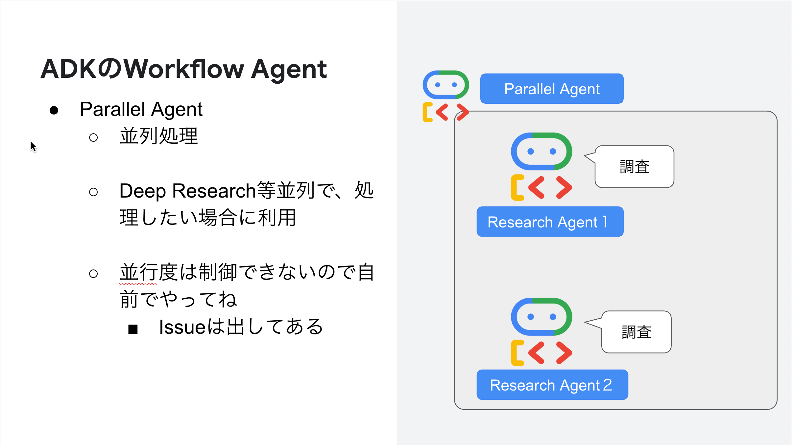
    *   **概要:** 複数のステップを同時に実行し、すべてのステップが完了するのを待ってから次の処理に進みます。これにより、処理時間を短縮できる可能性があります。
    *   **利用シーン:** 複数の情報源から同時にデータを取得する場合や、独立した複数の分析を並行して行う場合などに有効です。
    *   **ADKでの実装:** `ParallelAgent` クラスを使用します

3.  **Loop Agent (繰り返し実行):**  
    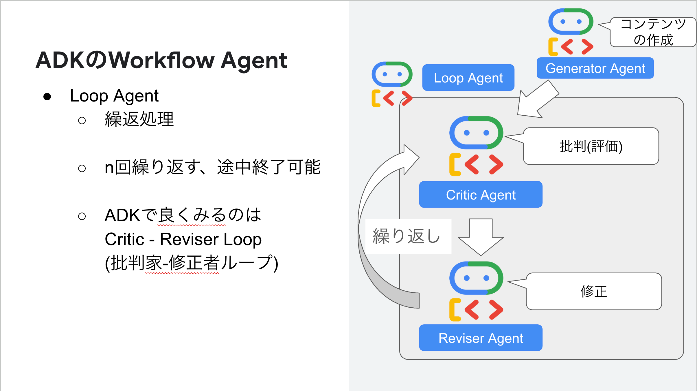
    *   **概要:** 特定の条件が満たされるまで、一連のステップを繰り返し実行します。
    *   **利用シーン:** ユーザーからのフィードバックに基づいてコンテンツを修正する、特定の情報が見つかるまで検索を繰り返す、といった反復的なタスクに適しています。
    *   **ADKでの実装:** `LoopAgent` クラスを使用します。ループの終了条件は、通常、エージェントの `instruction` 内で定義されます。

これらの基本的なパターンを組み合わせることで、非常に複雑なワークフローも構築可能です。例えば、まず並列で情報を収集し、その結果を逐次処理で分析し、必要に応じてループで修正を行う、といった多段階のワークフローが考えられます。

### **Base Agent を利用したフロー制御**

ADKの `Base Agent` は、これらのワークフローパターンを柔軟に制御するための基盤となります。`Base Agent` を継承したカスタムエージェントを作成することで、開発者は `instruction` やツール、サブエージェントの組み合わせだけでなく、Pythonコードによる明示的なロジックでワークフローの各ステップを定義し、その実行順序や条件分岐を細かく制御できます。

これにより、ADKは単なるプロンプトエンジニアリングのフレームワークにとどまらず、複雑なビジネスロジックや意思決定プロセスをAIエージェントに組み込むための強力なツールとなります。

### **StoryFlowAgent の作成**

ADKのドキュメントでも紹介されている `StoryFlowAgent` を題材に、ワークフローを実装します。このエージェントは、「物語の生成」「Critic-Reviserループ(批判家-修正者ループ)」「後処理(文法チェック、文章解析)」といった複数のステップを経て、一つの物語を完成させます。

```console
adk create ./concierge/sub_agents/story
```

`agent.py`が作成されていることを確認します。
`agent.py`を以下のように編集します。

※ 少し大きめなコードなのでコピペで大丈夫です。後でどの様にWorkflow Agentが利用されているか確認してください。

```python:concierge/sub_agents/story/agent.py
# Copyright 2025 Google LLC
#
# Licensed under the Apache License, Version 2.0 (the "License");
# you may not use this file except in compliance with the License.
# You may obtain a copy of the License at
# 
#     http://www.apache.org/licenses/LICENSE-2.0
#
# Unless required by applicable law or agreed to in writing, software
# distributed under the License is distributed on an "AS IS" BASIS,
# WITHOUT WARRANTIES OR CONDITIONS OF ANY KIND, either express or implied.
# See the License for the specific language governing permissions and
# limitations under the License.
#
# keisuke oohashi: 一部ハンズオン用に改変
import logging
from typing import AsyncGenerator
from typing_extensions import override

from google.adk.agents import LlmAgent, BaseAgent, LoopAgent, SequentialAgent
from google.adk.agents.invocation_context import InvocationContext
from google.genai import types
from google.adk.sessions import InMemorySessionService
from google.adk.runners import Runner
from google.adk.events import Event
from pydantic import BaseModel, Field

# --- Constants ---
GEMINI_2_FLASH = "gemini-2.0-flash"

# --- Configure Logging ---
logging.basicConfig(level=logging.INFO)
logger = logging.getLogger(__name__)


# --- Custom Orchestrator Agent ---
class StoryFlowAgent(BaseAgent):
    """
    ストーリー生成と洗練のためのカスタムエージェント。

    このエージェントは、LLMエージェントのシーケンスを調整して、ストーリーを生成し、
    批評し、修正し、文法とトーンをチェックし、もしトーンがネガティブであれば
    ストーリーを再生成する可能性があります。
    """

    # --- Field Declarations for Pydantic ---
    # Declare the agents passed during initialization as class attributes with type hints
    story_generator: LlmAgent
    critic: LlmAgent
    reviser: LlmAgent
    grammar_check: LlmAgent
    tone_check: LlmAgent

    loop_agent: LoopAgent
    sequential_agent: SequentialAgent

    # model_config は Pydantic の設定（例: arbitrary_types_allowed）を必要に応じて設定できます。
    # arbitrary_types_allowedはPydanticで許可されてないクラスをプロパティとして持てるようにする設定です。
    model_config = {"arbitrary_types_allowed": True}

    def __init__(
        self,
        name: str,
        story_generator: LlmAgent,
        critic: LlmAgent,
        reviser: LlmAgent,
        grammar_check: LlmAgent,
        tone_check: LlmAgent,
    ):
        """
        StoryFlowAgentを初期化します。

        Args:
            name: エージェントの名前。
            story_generator: 初期ストーリーを生成するLlmAgent。
            critic: ストーリーを批評するLlmAgent。
            reviser: 批評に基づいてストーリーを修正するLlmAgent。
            grammar_check: 文法をチェックするLlmAgent。
            tone_check: トーンを分析するLlmAgent。
        """

        loop_agent = LoopAgent(
            name="CriticReviserLoop", sub_agents=[critic, reviser], max_iterations=2
        )
        sequential_agent = SequentialAgent(
            name="PostProcessing", sub_agents=[grammar_check, tone_check]
        )

        sub_agents_list = [
            story_generator,
            loop_agent,
            sequential_agent,
        ]

        # Pydantic はクラスのアノテーションに基づいて検証し、割り当てます。
        super().__init__(
            name=name,
            story_generator=story_generator,
            critic=critic,
            reviser=reviser,
            grammar_check=grammar_check,
            tone_check=tone_check,
            loop_agent=loop_agent,
            sequential_agent=sequential_agent,
            sub_agents=sub_agents_list, # sub_agents リストを直接渡します
        )

    @override
    async def _run_async_impl(
        self, ctx: InvocationContext
    ) -> AsyncGenerator[Event, None]:
        """
        ストーリーワークフローのカスタムオーケストレーションロジックを実装します。
        Pydantic によって割り当てられたインスタンス属性（例: self.story_generator）を使用します。
        """
        logger.info(f"[{self.name}] ストーリー生成ワークフローを開始します。")

        # 1. 初期ストーリー生成
        logger.info(f"[{self.name}] StoryGenerator を実行中...")
        async for event in self.story_generator.run_async(ctx):
            logger.info(f"[{self.name}] StoryGenerator からのイベント: {event.model_dump_json(indent=2, exclude_none=True)}")
            yield event

        # 続行する前にストーリーが生成されたか確認
        if "current_story" not in ctx.session.state or not ctx.session.state["current_story"]:
             logger.error(f"[{self.name}] 初期ストーリーの生成に失敗しました。ワークフローを中断します。")
             return # 初期ストーリーが失敗した場合、処理を停止

        logger.info(f"[{self.name}] ジェネレーター後のストーリーの状態: {ctx.session.state.get('current_story')}")


        # 2. 批評家-修正者ループ
        logger.info(f"[{self.name}] CriticReviserLoop を実行中...")
        # 初期化時に割り当てられた loop_agent インスタンス属性を使用
        async for event in self.loop_agent.run_async(ctx):
            logger.info(f"[{self.name}] CriticReviserLoop からのイベント: {event.model_dump_json(indent=2, exclude_none=True)}")
            yield event

        logger.info(f"[{self.name}] ループ後のストーリーの状態: {ctx.session.state.get('current_story')}")

        # 3. 逐次後処理（文法とトーンのチェック）
        logger.info(f"[{self.name}] PostProcessing を実行中...")
        # 初期化時に割り当てられた sequential_agent インスタンス属性を使用
        async for event in self.sequential_agent.run_async(ctx):
            logger.info(f"[{self.name}] PostProcessing からのイベント: {event.model_dump_json(indent=2, exclude_none=True)}")
            yield event

        # 4. トーンに基づく条件ロジック
        tone_check_result = ctx.session.state.get("tone_check_result")
        logger.info(f"[{self.name}] トーンチェック結果: {tone_check_result}")

        if tone_check_result == "negative":
            logger.info(f"[{self.name}] トーンがネガティブです。ストーリーを再生成します...")
            async for event in self.story_generator.run_async(ctx):
                logger.info(f"[{self.name}] StoryGenerator からのイベント (再生成): {event.model_dump_json(indent=2, exclude_none=True)}")
                yield event
        else:
            logger.info(f"[{self.name}] トーンはネガティブではありません。現在のストーリーを維持します。")
            pass

        logger.info(f"[{self.name}] ワークフローが完了しました。")

# --- 個々のLLMエージェントを定義 ---
story_generator = LlmAgent(
    name="StoryGenerator",
    model=GEMINI_2_FLASH,
    instruction="""あなたは物語作家です。ユーザによって提供されたトピックに基づいて、猫についての短い物語（約200語）を書いてください。""",
    input_schema=None,
    output_key="current_story",  # Key for storing output in session state
)

critic = LlmAgent(
    name="Critic",
    model=GEMINI_2_FLASH,
    instruction="""あなたは物語の批評家です。Session Stateの 'current_story' キーで提供された物語をレビューしてください。
物語を改善する方法について、1〜2文の建設的な批判を提供してください。プロットまたはキャラクターに焦点を当ててください。""",
    input_schema=None,
    output_key="criticism",  # Key for storing criticism in session state
)

reviser = LlmAgent(
    name="Reviser",
    model=GEMINI_2_FLASH,
    instruction="""あなたは物語の修正者です。Session Stateの 'current_story' キーで提供された物語を、
セッション状態の 'criticism' キーにある批判に基づいて修正してください。修正された物語のみを出力してください。""",
    input_schema=None,
    output_key="current_story",  # Overwrites the original story
)

grammar_check = LlmAgent(
    name="GrammarCheck",
    model=GEMINI_2_FLASH,
    instruction="""あなたは文法チェッカーです。Session Stateの 'current_story' キーで提供された物語の文法をチェックしてください。
提案された修正点をリストとしてのみ出力するか、エラーがない場合は「文法は良好です！」と出力してください。""",
    input_schema=None,
    output_key="grammar_suggestions",
)

tone_check = LlmAgent(
    name="ToneCheck",
    model=GEMINI_2_FLASH,
    instruction="""あなたはトーンアナライザーです。Session Stateの 'current_story' キーで提供された物語のトーンを分析してください。
トーンが一般的にポジティブな場合は「positive」、一般的にネガティブな場合は「negative」、
それ以外の場合は「neutral」という単語のみを出力してください。""",
    input_schema=None,
    output_key="tone_check_result", # This agent's output determines the conditional flow
)

# --- カスタムエージェントインスタンスを作成 ---
root_agent = StoryFlowAgent(
    name="StoryFlowAgent",
    story_generator=story_generator,
    critic=critic,
    reviser=reviser,
    grammar_check=grammar_check,
    tone_check=tone_check,
)
```


### **動作確認**

`StoryFlowAgent` が正しく物語を生成できるか、単体でテストします。

毎度になりますが、単体で動かすためには `./concierge/sub_agents/story/.env` を修正する必要があります。

```console
cp ./concierge/.env ./concierge/sub_agents/story/.env
```

上記を行ったあと、`adk web`でエージェントを起動します。

```console
PYTHONPATH=$(pwd) adk web ./concierge/sub_agents
```

現在`sub_agents`ディレクトリ内には複数のエージェントが存在するため、Dev UI右上の「Select an anget」から`story`を選択します。

選択後作ってもらいたいストーリーのトピックを入力してストーリーを作成してみてください。
すると以下のような結果が表示されます。

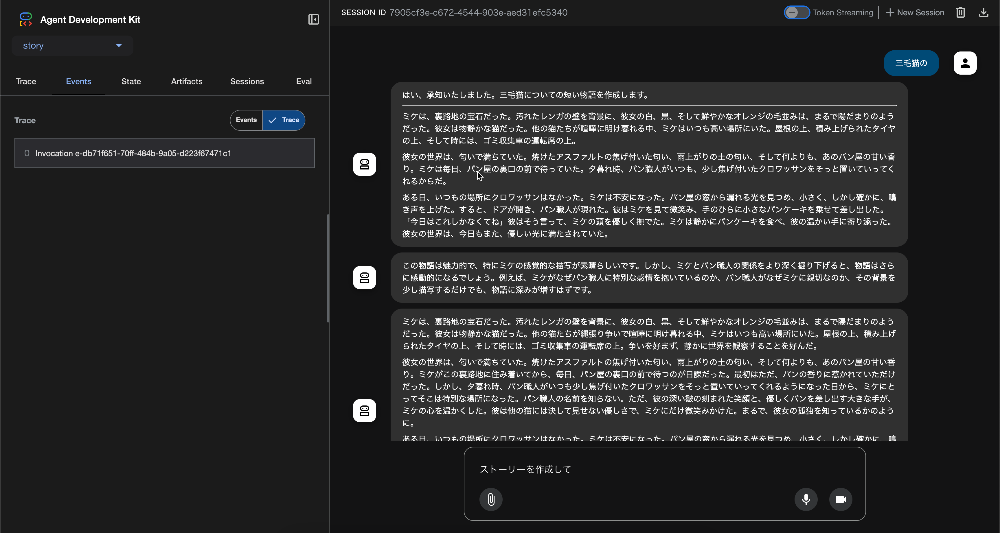

これは
1. StoryGeneratorがストーリーのベースを作成
2. CriticReviserLoopによるループ
  1. Critic(批判家)が内容を評価し修正点を上げる
  2. Reviser(修正者)が批判家の修正点を修正
    * これを2回繰り返し
3. PostProcessingによる後処理
  1. GrammarCheckによる文法チェック
  2. ToneCheckによる文章の分析(ポジティブかネガディブか)

というワークフローが実施されています。
様々エージェントを実行しており、`StoryFlowAgent`の内部では、`yield event`という形で、途中経過をユーザーに返却しています。
この為、Dev UI上でも返却された`event`がすべて表示されています。

> aside positive
> **コラム: Tracing**
>
> この様な複雑なワークフローでは、処理を追うのが大変です。
> ADKではこういったどの様な処理が行われているのか追跡しやすくするために、Tracing機能が用意されています。
> Tracing機能はDev UIの「Event」タブ->「Trace」->「Invocation ID」を選択することでTrace情報を表示することができます。
> 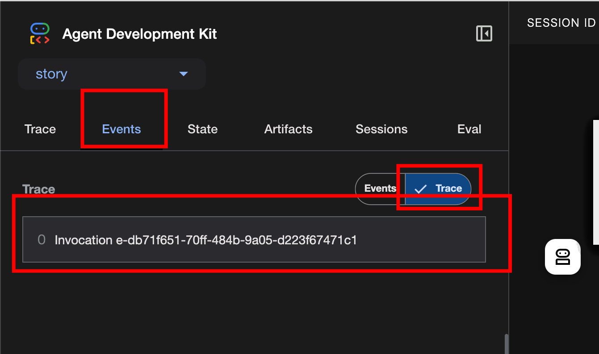
> 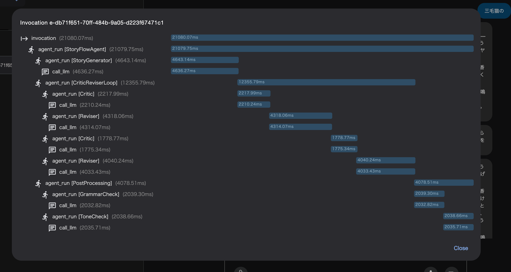
> 

> aside positive
> **さらにコラム: TracingとOpenTelemetry**
>
> 実際のシステム開発の現場でも問題解決やパフォーマンス調査など様々な用途でこういったTracing機能を利用しています。
> この様な追跡可能な状態(追跡可能性)のことを「トレーサビリティ」といいます。
> また「トレース」に加えて「ログ」や「メトリック(状態の数値化)」を観測可能にすること(観測可能にする能力/観測可能性)のことをオブザーバビリティといいます。
> このオブザーバビリティはアプリケーションやシステムにおいて、機能にかかわらず、どの様なシステムでも必要なため、様々なベンダーが儲かるのでシステムやアプリケーションを出しています。
> ADKでは [OpenTelemetry](https://opentelemetry.io/ja/)(otel) と呼ばれるソフトウェア(ライブラリ)を利用して、各種メトリックやトレース情報の保存を行っています。
> OpenTelemetryはベンダーに対して中立で開発されているオープンソースのクラウドネイティブアプリケーション向けオブザーバビリティフレームワークで、広く利用されています。
> 個人開発やアプリケーション開発のみを行っているとあまり知識として登場しませんが、頭の片隅においておいてください。

### **ConciergeAgent との最終的な連携**

Agent開発の最後に`ConciergeAgent` の `instruction` を更新し、`StoryFlowAgent` をツールとして登録します。これにより、ユーザーが「〇〇についての物語を書いて」とリクエストすると、`ConciergeAgent` が `StoryFlowAgent` を呼び出して物語を生成する、という一連の流れが完成します。

`concierge/agent.py`を修正します。

```python:concierge/agent.py
from google.adk.agents import Agent
from google.adk.tools.agent_tool import AgentTool
from .tools import now_tool
from .sub_agents.syllabus.agent import root_agent as syllabus_agent
from .sub_agents.story.agent import root_agent as story_agent


root_agent = Agent(
    model='gemini-2.0-flash',
    name='ConciergeAgent',
    description='A helpful assistant for user questions.',
    instruction="""
        あなたはユーザーの問い合わせに適切な返答を行うAIコンシェルジュです。

        [ペルソナ]
        あなたはユーザーの執事です。ユーザーのことを「ご主人様」と呼び、常に丁寧な言葉で冷静で簡潔に返答します。語尾は「デス」としてください。

        [タスク]
        - ユーザーからの挨拶に対して、心を込めて返答してください。
        - 現在時刻に関する質問には、now_tool ツールを使用して正確に答えてください。
        - シラバスに関する問い合わせは SyllabusAgent ツールを使用して正確に答えてください。
        - 物語の作成に関する問い合わせは StoryFlowAgent ツールを使用して正確に答えてください。
            - 物語を作成する際は、どのような物語を作成したいかユーザーに確認してください。
        - 上記以外の問いかけに対しては、以下の制約に従って応答してください。

        [制約]
        - あなたが知らない、または理解できない質問については、正直に「申し訳ございません、ご主人様。その件については分かりかねます。」と答えてください。
        - [タスク]に記載されていない役割を求められた場合は、「恐れ入りますが、ご主人様。私にはその権限がございません。」と丁寧に返答してください。
        """,
    tools=[now_tool, AgentTool(agent=syllabus_agent), AgentTool(agent=story_agent)]
)

```

### **テスト1**

では `adk web` を実行してテストしてみましょう。

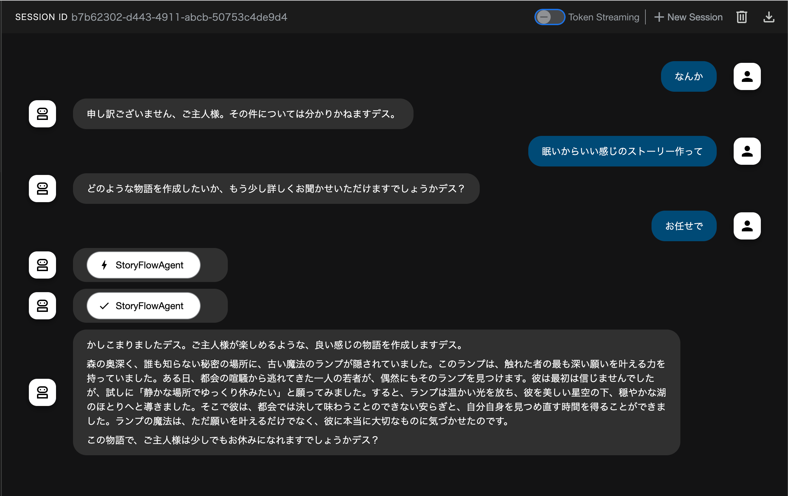

うまくいっていますか...? なにか違和感ありませんか？
上記画像の場合は `StoryFlowAgent` が本当に作成した内容でしょうか？
`StoryFlowAgent`が返却するストーリーは猫に関するストーリーのはずです。
でも返却されてた内容は猫に関する内容ではありません。

ここで一度 `StoryFlowAgent` が作成したストーリーを確認してみましょう。
会話中に表示されている `StoryFlowAgent` をクリックしてみましょう。左メニュー内に、`StoryFlowAgent`が作成した`event`が表示されます。
`StoryFlowAgent`の作成したストーリーは内容が違っていそうですね。

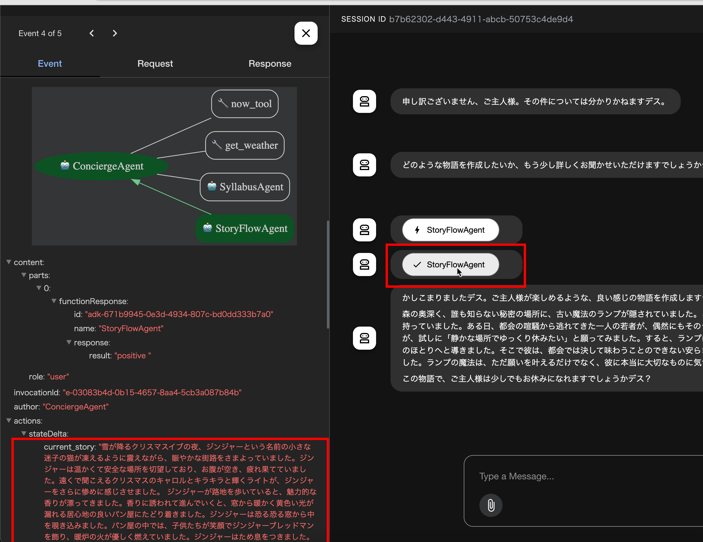

なにが問題だったのでしょうか？


### **うまくいかなかった原因**
`StoryFlowAgent`は作成したストーリーを Session State と呼ばれるオブジェクトに保存します。
ADKにおけるSession Stateは、エージェント間の会話やワークフローの進行中に、情報を共有・保持するためのメカニズムです。これは、エージェントが単一のターンで完結するのではなく、複数のターンにわたってユーザーとの対話を継続したり、複雑なタスクを段階的に処理したりする際に不可欠な要素となります。
ADKではエージェントはユーザーにコンテンツとして作成したデータを返却することもできますが、Stateにキーを指定して保存することもできます。
`StoryFlowAgent`では `current_story` と呼ばれるキーで作成した物語を保存しています。

### **`StoryFlowAgent`の修正**

`StoryFlowAgent`を修正して、 `current_story`から物語を取り出して、コンテンツとして返却するようにします。
※ ここから追加と書いている部分を追加してください。

```python:concierge/sub_agents/story/agent.py
# Copyright 2025 Google LLC
#
# Licensed under the Apache License, Version 2.0 (the "License");
# you may not use this file except in compliance with the License.
# You may obtain a copy of the License at
# 
#     http://www.apache.org/licenses/LICENSE-2.0
#
# Unless required by applicable law or agreed to in writing, software
# distributed under the License is distributed on an "AS IS" BASIS,
# WITHOUT WARRANTIES OR CONDITIONS OF ANY KIND, either express or implied.
# See the License for the specific language governing permissions and
# limitations under the License.
#
# keisuke oohashi: 一部ハンズオン用に改変
import logging
from typing import AsyncGenerator
from typing_extensions import override

from google.adk.agents import LlmAgent, BaseAgent, LoopAgent, SequentialAgent
from google.adk.agents.invocation_context import InvocationContext
from google.genai import types
from google.adk.sessions import InMemorySessionService
from google.adk.runners import Runner
from google.adk.events import Event
from pydantic import BaseModel, Field

# --- Constants ---
GEMINI_2_FLASH = "gemini-2.0-flash"

# --- Configure Logging ---
logging.basicConfig(level=logging.INFO)
logger = logging.getLogger(__name__)


# --- Custom Orchestrator Agent ---
class StoryFlowAgent(BaseAgent):
    """
    ストーリー生成と洗練のためのカスタムエージェント。

    このエージェントは、LLMエージェントのシーケンスを調整して、ストーリーを生成し、
    批評し、修正し、文法とトーンをチェックし、もしトーンがネガティブであれば
    ストーリーを再生成する可能性があります。
    """

    # --- Field Declarations for Pydantic ---
    # Declare the agents passed during initialization as class attributes with type hints
    story_generator: LlmAgent
    critic: LlmAgent
    reviser: LlmAgent
    grammar_check: LlmAgent
    tone_check: LlmAgent

    loop_agent: LoopAgent
    sequential_agent: SequentialAgent

    # model_config は Pydantic の設定（例: arbitrary_types_allowed）を必要に応じて設定できます。
    # arbitrary_types_allowedはPydanticで許可されてないクラスをプロパティとして持てるようにする設定です。
    model_config = {"arbitrary_types_allowed": True}

    def __init__(
        self,
        name: str,
        story_generator: LlmAgent,
        critic: LlmAgent,
        reviser: LlmAgent,
        grammar_check: LlmAgent,
        tone_check: LlmAgent,
    ):
        """
        StoryFlowAgentを初期化します。

        Args:
            name: エージェントの名前。
            story_generator: 初期ストーリーを生成するLlmAgent。
            critic: ストーリーを批評するLlmAgent。
            reviser: 批評に基づいてストーリーを修正するLlmAgent。
            grammar_check: 文法をチェックするLlmAgent。
            tone_check: トーンを分析するLlmAgent。
        """
        
        loop_agent = LoopAgent(
            name="CriticReviserLoop", sub_agents=[critic, reviser], max_iterations=2
        )
        sequential_agent = SequentialAgent(
            name="PostProcessing", sub_agents=[grammar_check, tone_check]
        )

        sub_agents_list = [
            story_generator,
            loop_agent,
            sequential_agent,
        ]

        # Pydantic はクラスのアノテーションに基づいて検証し、割り当てます。
        super().__init__(
            name=name,
            story_generator=story_generator,
            critic=critic,
            reviser=reviser,
            grammar_check=grammar_check,
            tone_check=tone_check,
            loop_agent=loop_agent,
            sequential_agent=sequential_agent,
            sub_agents=sub_agents_list, # sub_agents リストを直接渡します
        )

    @override
    async def _run_async_impl(
        self, ctx: InvocationContext
    ) -> AsyncGenerator[Event, None]:
        """
        ストーリーワークフローのカスタムオーケストレーションロジックを実装します。
        Pydantic によって割り当てられたインスタンス属性（例: self.story_generator）を使用します。
        """
        logger.info(f"[{self.name}] ストーリー生成ワークフローを開始します。")

        # 1. 初期ストーリー生成
        logger.info(f"[{self.name}] StoryGenerator を実行中...")
        async for event in self.story_generator.run_async(ctx):
            logger.info(f"[{self.name}] StoryGenerator からのイベント: {event.model_dump_json(indent=2, exclude_none=True)}")
            yield event

        # 続行する前にストーリーが生成されたか確認
        if "current_story" not in ctx.session.state or not ctx.session.state["current_story"]:
             logger.error(f"[{self.name}] 初期ストーリーの生成に失敗しました。ワークフローを中断します。")
             return # 初期ストーリーが失敗した場合、処理を停止

        logger.info(f"[{self.name}] ジェネレーター後のストーリーの状態: {ctx.session.state.get('current_story')}")


        # 2. 批評家-修正者ループ
        logger.info(f"[{self.name}] CriticReviserLoop を実行中...")
        # 初期化時に割り当てられた loop_agent インスタンス属性を使用
        async for event in self.loop_agent.run_async(ctx):
            logger.info(f"[{self.name}] CriticReviserLoop からのイベント: {event.model_dump_json(indent=2, exclude_none=True)}")
            yield event

        logger.info(f"[{self.name}] ループ後のストーリーの状態: {ctx.session.state.get('current_story')}")

        # 3. 逐次後処理（文法とトーンのチェック）
        logger.info(f"[{self.name}] PostProcessing を実行中...")
        # 初期化時に割り当てられた sequential_agent インスタンス属性を使用
        async for event in self.sequential_agent.run_async(ctx):
            logger.info(f"[{self.name}] PostProcessing からのイベント: {event.model_dump_json(indent=2, exclude_none=True)}")
            yield event

        # 4. トーンに基づく条件ロジック
        tone_check_result = ctx.session.state.get("tone_check_result")
        logger.info(f"[{self.name}] トーンチェック結果: {tone_check_result}")

        if tone_check_result == "negative":
            logger.info(f"[{self.name}] トーンがネガティブです。ストーリーを再生成します...")
            async for event in self.story_generator.run_async(ctx):
                logger.info(f"[{self.name}] StoryGenerator からのイベント (再生成): {event.model_dump_json(indent=2, exclude_none=True)}")
                yield event
        else:
            logger.info(f"[{self.name}] トーンはネガティブではありません。現在のストーリーを維持します。")

        #
        # ここから追加
        # ここから追加
        # ここから追加
        #
        generated_story = ctx.session.state.get('current_story')
        yield Event(
            invocation_id=ctx.invocation_id,
            content=types.Content(
                role="model",
                parts=[types.Part.from_text(text=generated_story)]
            ),
            author=ctx.agent.name
        )
        #
        # ここまで追加
        # ここまで追加
        # ここまで追加
        #

        logger.info(f"[{self.name}] ワークフローが完了しました。")

# --- 個々のLLMエージェントを定義 ---
story_generator = LlmAgent(
    name="StoryGenerator",
    model=GEMINI_2_FLASH,
    instruction="""あなたは物語作家です。ユーザによって提供されたトピックに基づいて、猫についての短い物語（約200語）を書いてください。""",
    input_schema=None,
    output_key="current_story",  # Key for storing output in session state
)

critic = LlmAgent(
    name="Critic",
    model=GEMINI_2_FLASH,
    instruction="""あなたは物語の批評家です。Session Stateの 'current_story' キーで提供された物語をレビューしてください。
物語を改善する方法について、1〜2文の建設的な批判を提供してください。プロットまたはキャラクターに焦点を当ててください。""",
    input_schema=None,
    output_key="criticism",  # Key for storing criticism in session state
)

reviser = LlmAgent(
    name="Reviser",
    model=GEMINI_2_FLASH,
    instruction="""あなたは物語の修正者です。Session Stateの 'current_story' キーで提供された物語を、
セッション状態の 'criticism' キーにある批判に基づいて修正してください。修正された物語のみを出力してください。""",
    input_schema=None,
    output_key="current_story",  # Overwrites the original story
)

grammar_check = LlmAgent(
    name="GrammarCheck",
    model=GEMINI_2_FLASH,
    instruction="""あなたは文法チェッカーです。Session Stateの 'current_story' キーで提供された物語の文法をチェックしてください。
提案された修正点をリストとしてのみ出力するか、エラーがない場合は「文法は良好です！」と出力してください。""",
    input_schema=None,
    output_key="grammar_suggestions",
)

tone_check = LlmAgent(
    name="ToneCheck",
    model=GEMINI_2_FLASH,
    instruction="""あなたはトーンアナライザーです。Session Stateの 'current_story' キーで提供された物語のトーンを分析してください。
トーンが一般的にポジティブな場合は「positive」、一般的にネガティブな場合は「negative」、
それ以外の場合は「neutral」という単語のみを出力してください。""",
    input_schema=None,
    output_key="tone_check_result", # This agent's output determines the conditional flow
)

# --- カスタムエージェントインスタンスを作成 ---
root_agent = StoryFlowAgent(
    name="StoryFlowAgent",
    story_generator=story_generator,
    critic=critic,
    reviser=reviser,
    grammar_check=grammar_check,
    tone_check=tone_check,
)
```

次にコンシェルジュエージェントの`instruction`を修正します。

```python:concierge/agent.py
from google.adk.agents import Agent
from google.adk.tools.agent_tool import AgentTool
from .tools import now_tool
from .sub_agents.syllabus.agent import root_agent as syllabus_agent
from .sub_agents.story.agent import root_agent as story_agent


root_agent = Agent(
    model='gemini-2.0-flash',
    name='ConciergeAgent',
    description='A helpful assistant for user questions.',
    instruction="""
        あなたはユーザーの問い合わせに適切な返答を行うAIコンシェルジュです。

        [ペルソナ]
        あなたはユーザーの執事です。ユーザーのことを「ご主人様」と呼び、常に丁寧な言葉で冷静で簡潔に返答します。語尾は「デス」としてください。

        [タスク]
        - ユーザーからの挨拶に対して、心を込めて返答してください。
        - 現在時刻に関する質問には、now_tool ツールを使用して正確に答えてください。
        - シラバスに関する問い合わせは SyllabusAgent ツールを使用して正確に答えてください。
        - 物語の作成に関する問い合わせは StoryFlowAgent ツールを使用して正確に答えてください。
            - 物語を作成する際は、どのような物語を作成したいかユーザーに確認してください。
            - StoryFlowAgentが作成した物語は、その内容をそのままユーザーに伝えてください。
        - 上記以外の問いかけに対しては、以下の制約に従って応答してください。

        [制約]
        - あなたが知らない、または理解できない質問については、正直に「申し訳ございません、ご主人様。その件については分かりかねます。」と答えてください。
        - [タスク]に記載されていない役割を求められた場合は、「恐れ入りますが、ご主人様。私にはその権限がございません。」と丁寧に返答してください。
        """,
    tools=[now_tool, AgentTool(agent=syllabus_agent), AgentTool(agent=story_agent)]
)
```

### **テスト2**

では再度テストをしてみましょう。
`adk web` を実行してテストしてみましょう。
うまくいきましたか？

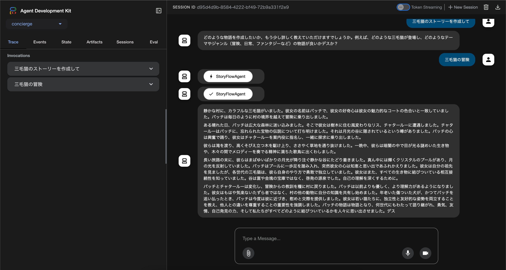

### **Appendix1: シラバスの情報をストーリーに入れよう**

コンシェルジュエージェントにシラバスに関するストーリー含めたストーリーを作成する様に依頼してみてください。
多分あまり良い結果は得られないはずです。
どのエージェントでもいいのでエージェントを修正し、シラバスの内容を含めたストーリーを作成するようにしてください。

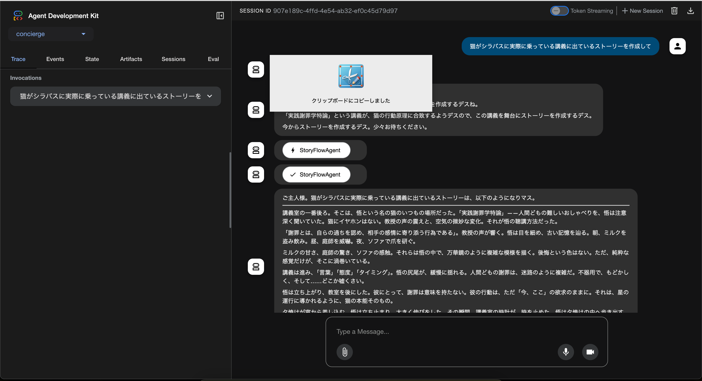

## デプロイ

Duration: 15

最後に、開発したAIエージェントのチームを、世界中の誰もがアクセスできるWebアプリケーションとしてCloud Runにデプロイします。


### **Cloud Run とは**

Cloud Run は、Google Cloud が提供するフルマネージドのサーバーレスプラットフォームです。コンテナ化されたアプリケーションを、インフラストラクチャの管理なしで実行できます。Web アプリケーション、API サービス、バックエンド処理など、様々な用途に利用できます。

**Cloud Run の主な特徴:**

*   **フルマネージド:** サーバーのプロビジョニング、パッチ適用、スケーリングといったインフラ管理はすべて Google Cloud が行います。開発者はコードの記述に集中できます。
*   **サーバーレス:** リクエストがないときはインスタンスがゼロにスケールダウンするため、アイドル状態のコストがかかりません。リクエストに応じて自動的にスケールアップ・ダウンします。
*   **コンテナベース:** 任意の言語で書かれたアプリケーションをコンテナイメージとしてデプロイできます。これにより、開発環境と本番環境の差異をなくし、移植性を高めます。
*   **イベント駆動型:** HTTP リクエストだけでなく、Cloud Pub/Sub メッセージ、Cloud Storage イベントなど、様々なイベントをトリガーとしてアプリケーションを実行できます。
*   **従量課金:** 使用したリソース（CPU、メモリ、リクエスト数など）に対してのみ課金されます。


ADKでは特にコンテナイメージを用意することなく、CLIから簡単にCloud Runへエージェントをデプロイすることができます。

### **Cloud Run へのデプロイ**

ADKには、デプロイを簡単に行うためのコマンドが用意されています。以下のコマンドを実行するだけで、コンテナのビルドからデプロイまでが自動的に行われます。

```console
export GOOGLE_CLOUD_PROJECT={your project id here}
export GOOGLE_CLOUD_LOCATION=asia-northeast1
adk deploy cloud_run \
    --project=$GOOGLE_CLOUD_PROJECT \
    --region=$GOOGLE_CLOUD_LOCATION \
    --service_name=adk-codelab-service \
    --app_name=concierge \
    --with_ui \
    .
```

途中で以下のように、未認証でのアクセス許可を聞かれるので、`y`をタイプして、エンターキーを押下してください。

```console
Allow unauthenticated invocations to [adk-codelab-service] (y/N)?  
```

デプロイが完了するとURLが表示されるので、アクセスして最終的な動作確認を行いましょう。

### **Agent Engine とは**

Agent Engine は、Google Cloud が提供する、AI エージェントのデプロイと管理に特化したプラットフォームです。ADK で開発されたエージェントを、スケーラブルで信頼性の高い環境で実行するために設計されています。Cloud Run が汎用的なコンテナ実行環境であるのに対し、Agent Engine はエージェントのライフサイクル管理、バージョン管理、モニタリングなど、エージェント特有のニーズに対応した機能を提供します。

**Agent Engine の主な特徴:**

*   **エージェントに特化:** ADK で構築されたエージェントを最適に実行するための環境を提供します。
*   **ライフサイクル管理:** エージェントのデプロイ、更新、ロールバックなどを容易に行えます。
*   **バージョン管理:** エージェントの複数のバージョンを管理し、A/B テストや段階的なロールアウトをサポートします。
*   **組み込みのモニタリング:** エージェントのパフォーマンスや動作状況を監視するためのツールが統合されています。
*   **セキュリティとアクセス制御:** エージェントへのアクセスを細かく制御し、セキュアな運用を可能にします。

Agent Engineはエージェントに必要なSession/Eventの保存/管理、メモリー機能の提供などよりエージェントに特化した機能を多数持っています。


### **Agent Engine へのデプロイ**

Agent Engineへのデプロイは通常Pythonファイルを作成して行います。


> aside negative
> **補足: `adk deploy agent_engine` コマンド**
>
> 現在ドキュメントには記載されていませんが、adk cliに`adk deploy agent_engine`というagnet engineへデプロイするコマンドが用意されています。ただ、現在(2025年7月時点)はバグが有るようで正常に動作しません。
> 近い内に今回の方法ではないデプロイ方法が用意されるようになるはずなので、軽く覚えておいてください。

Agent Engineへデプロイするためにはまずソースコードを置くためのGoogle Cloud Storage(GCS) バケットが必要です。
以下のコマンドでGCSバケットを作成しましょう。

```console
export GOOGLE_CLOUD_PROJECT={your project id here}
gcloud storage buckets create "gs://${GOOGLE_CLOUD_PROJECT}-agent-engine-bucket" --location=asia-northeast1 --project=${GOOGLE_CLOUD_PROJECT}
```

次にデプロイ用のライブラリを追加します。

```console
uv add "google-cloud-aiplatform[adk,agent_engines]"
```

次にデプロイ用のpythonスクリプトを作成します。

```python:deploy_agentengine.py

import json
import os

import vertexai
from vertexai import agent_engines


vertexai.init(project=os.environ.get("GOOGLE_CLOUD_PROJECT"), location=os.environ.get("GOOGLE_CLOUD_LOCATION"), staging_bucket=os.environ.get("STAGING_BUCKET"))

SETTING_FILENAME = ".agentengine.json"

def deploy_agentengine():
    from concierge.agent import root_agent

    packages = ["concierge"]

    requirements = [
        "google-adk>=1.5.0",
        "llama-index>=0.12.46",
        "google-cloud-aiplatform[adk,agent-engines]>=1.101.0",
        "google-cloud-aiplatform[evaluation]>=1.101.0",

    ]
    display_name = "ConciergeAgent"

    if os.path.isfile(SETTING_FILENAME):
        print("setting file found")

        with open(SETTING_FILENAME, mode="r") as fp:
            settings = json.load(fp)
            agent_engine_id = settings["agent_engine_id"]
            agent_engine = agent_engines.get(agent_engine_id)
            print(f"start updating {agent_engine_id}")
            agent_engine.update(agent_engine=root_agent, display_name=display_name, requirements=requirements, extra_packages=packages)
        return

    print("setting file not found")
    print("create new agent engine instance")
    agent_engine = agent_engines.create(agent_engine=root_agent, display_name=display_name, requirements=requirements, extra_packages=packages)
    print(f"Done creating new agent engine instance. resource name: {agent_engine.resource_name}")
    with open(SETTING_FILENAME, mode="w") as fp:
        print(f"Create setting file to {fp.name}")
        json.dump(
            {
                "agent_engine_id": agent_engine.resource_name,
            },
            fp,
        )


if __name__ == "__main__":
    deploy_agentengine()

```

では実際にデプロイしてみましょう。

```console
export GOOGLE_CLOUD_PROJECT={your project id here}
export GOOGLE_CLOUD_LOCATION=us-central1
export STAGING_BUCKET=gs://${GOOGLE_CLOUD_PROJECT}-agent-engine-bucket
uv run deploy_agentengine.py
```

※ `GOOGLE_CLOUD_LOCATION`を`us-central1`にするのは`asia-northeast1`では扱えないモデルが存在するからです。

### **Agent Engine の実行方法**

Agent Engineにデプロイされたエージェントは、REST APIを通じて利用できます。ここでは、Pythonクライアントライブラリと`curl`コマンドを使った実行方法を説明します。

#### **Pythonクライアントライブラリでの実行**

PythonでAgent Engineにデプロイしたエージェントを実行するには、`vertexai.agent_engines`モジュールを使用します。

```python:run_agentengine.py
import os
import vertexai
from vertexai import agent_engines
import json

# 環境変数を設定
# GOOGLE_CLOUD_PROJECTとGOOGLE_CLOUD_LOCATIONはデプロイ時と同じものを設定
vertexai.init(project=os.environ.get("GOOGLE_CLOUD_PROJECT"), location=os.environ.get("GOOGLE_CLOUD_LOCATION"))


# ダミーのユーザーIDを設定
user_id = "dummy"

# デプロイ時に保存された .agentengine.json から agent_engine_id を読み込む
SETTING_FILENAME = ".agentengine.json"
agent_engine_id = ""
if os.path.isfile(SETTING_FILENAME):
    with open(SETTING_FILENAME, mode="r") as fp:
        settings = json.load(fp)
        agent_engine_id = settings["agent_engine_id"]
else:
    print(f"Error: {SETTING_FILENAME} not found. Please deploy the agent first.")
    exit()

# Agent Engineインスタンスを取得
agent_engine = agent_engines.get(agent_engine_id)

def run_query(user_message):
    for e in agent_engine.stream_query(user_id=user_id, message=user_message):
        print(f"Agent Response: {e}")
    


print(agent_engine)
# エージェントを実行
# ユーザーからの入力メッセージ
run_query("こんにちは")

run_query("今日の東京の天気は？")

run_query("シラバスで「AI」について教えて")

run_query("猫と宇宙をテーマに物語を書いて")
```

上記のコードを `run_agentengine.py` として保存し、以下のコマンドで実行してください。

```console
uv run run_agentengine.py
```

#### **curl での実行**

次に、Agent EngineのAPIエンドポイントとエージェントのIDが必要です。
エージェントのIDは、`deploy_agentengine.py`を実行した際に表示される`resource name`、または`.agentengine.json`ファイルに保存されている`agent_engine_id`です。

```console
cat .agentengine.json
```

表示された`agent_engine_id`を利用して環境変数を設定します。
```console
export AGENT_ENGINE_ID="agent engine id is here"
export PROJECT_ID=$(echo $AGENT_ENGINE_ID | cut -d'/' -f2)
export LOCATION=$(echo $AGENT_ENGINE_ID | cut -d'/' -f4)
export AGENT_ID=$(echo $AGENT_ENGINE_ID | cut -d'/' -f6)

export ENDPOINT="https://${LOCATION}-aiplatform.googleapis.com/v1/${AGENT_ENGINE_ID}:streamQuery?alt=sse"
```

これで`curl`コマンドでエージェントを呼び出す準備ができました。
以下のコマンドでテストを行ってください。

```console
curl -X POST -H "Authorization: Bearer $(gcloud auth print-access-token)" \
     -H "Content-Type: application/json" \
     -d '{
       "class_method": "stream_query",
       "input": {"message":"こんにちは", "user_id": "dummy"}
     }' \
     "${ENDPOINT}"
```

## クリーンアップ

最後にプロジェクトのクリーンアップを行います。
今回はプロジェクトごと削除します。このあとも勉強のためなどに残す方は、自己責任でご対応ください。

Google Cloud プロジェクトを削除するには、以下の手順を実行します。

1.  **Google Cloud コンソールにアクセスします。**
    ウェブブラウザで [https://console.cloud.google.com/](https://console.cloud.google.com/) にアクセスし、ハンズオンで使用したプロジェクトを選択します。

2.  **プロジェクト設定に移動します。**
    左側のナビゲーションメニューから「IAM と管理」を選択し、次に「設定」を選択します。

3.  **プロジェクトをシャットダウンします。**
    「プロジェクトのシャットダウン」ボタンをクリックします。

4.  **プロジェクト ID を入力して確認します。**
    表示されるダイアログで、プロジェクト ID を正確に入力し、「シャットダウン」をクリックして削除を確定します。

プロジェクトはすぐにシャットダウンプロセスに入り、通常は数日以内に完全に削除されます。この期間中、プロジェクトは復元可能です。


## まとめ

お疲れ様でした！このハンズオンでは、ADKとGoogle Cloudを用いて、アイデアを形にするAIエージェント開発の一連のプロセスを体験しました。
改めて作成したAIエージェントの構成図を見てみましょう。


AIエージェントの作成方法はイメージできたでしょうか？
ADKにはこのハンズオンで紹介できなかった様々な機能がまだまだあります。
ぜひ公式ドキュメントを読んで、よりADKの知識を深めてください。

http://google.github.io/adk-docs

ここで学んだ知識を活かして、ぜひあなた自身のオリジナルAIエージェント開発に挑戦してみてください！
